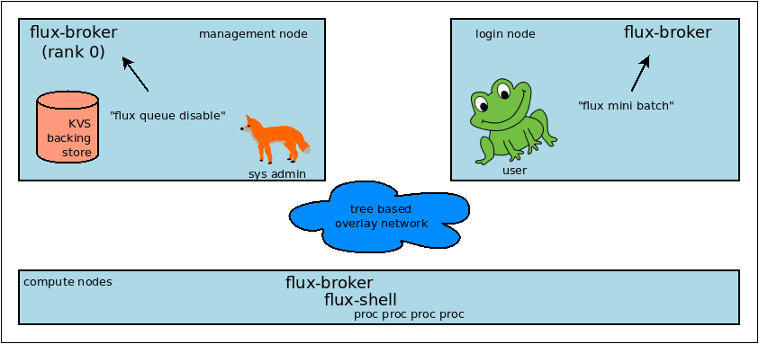

.. _admin-guide:

##########################
Flux Administrator's Guide
##########################

The *Flux Administrator's Guide* documents relevant information for
installation, configuration, and management of Flux as the native
resource manager on a cluster.

.. note::
    Flux is still beta software and many of the interfaces documented
    in this guide may change with regularity.

    This document is in DRAFT form and currently applies to flux-core
    version 0.42.0.

.. warning::
    0.42.0 limitation: the flux system instance is primarily tested on
    a 128 node cluster.

********
Overview
********

The base component of Flux is the :core:man1:`flux-broker` executable.  Most of
Flux's distributed systems and services that aren't directly associated
with a running job are embedded in that executable or its dynamically loaded
plugins.

Flux is often used in *single-user mode*, where a Flux instance (a ranked
set of brokers) is launched as a parallel job, and the *instance owner*
(the user that submitted the parallel job) has control of, and exclusive
access to, the resources assigned to the instance.  In fact, this user
has complete administrative control over the single user instance, including
the ability to alter Flux software.

When Flux is deployed as the native resource manager on a cluster, its brokers
still execute with the credentials of a non-privileged instance owner, but the
Flux instance operates somewhat differently:

- The Flux broker is started directly by systemd on each node instead of
  being launched as a process in a parallel job.
- The systemd unit file passes arguments to the broker that tell it to use
  system paths for various files, and to ingest TOML files from a system
  configuration directory.
- A single security certificate is used for the entire cluster instead of
  each broker generating one on the fly and exchanging public keys with PMI.
- The Flux overlay network endpoints are statically configured from files
  instead of being generated on on the fly and exchanged via PMI.
- The instance owner is a system account that does not correspond to an
  actual user.
- Users other than the instance owner (*guests*) are permitted to connect
  to the Flux broker, and are granted limited access to Flux services.
- Users connect to the Flux broker's AF_UNIX socket via a well known system URI
  if FLUX_URI is not set in the environment.
- Job processes (including the Flux job shell) are launched as the submitting
  user with the assistance of a setuid root helper on each node called the IMP.
- Job requests are signed with MUNGE, and this signature is verified by the IMP.
- The content of the Flux KVS, containing system state such as the set of
  drained nodes and the job queue, is preserved across a full Flux restart.
- The system instance functions with some nodes offline.
- The system instance has no *initial program*.

The same Flux executables are used in both single user and system modes,
with operation differentiated only by configuration.

Although a Flux single user instance can be launched by any resource manager
or process launcher, a single user Flux instance has access to a richer
environment when it is launched by a Flux system instance.  For example,
the Fluxion graph scheduler can hierarchically schedule advanced resource types
when its resources are statically configured at the system level;  otherwise,
Fluxion is limited to resource types and relationships that can be dynamically
probed.

   Fox prevents Frog from submitting jobs on a cluster with Flux
   as the system resource manager.

Some aspects of Flux have matured in the single user environment, however Flux
has a ways to go to reach feature parity with system level resource managers
like SLURM.  Flux limitations are documented in warning boxes throughout this
text.  Most are expected to be short term obstacles as Flux system capability
is expanded to meet deployment goals in 2022.  During this period of
development and testing, we appreciate your design feedback, bug reports,
and patience.

************
Installation
************

System Prerequisites
====================

`MUNGE <https://github.com/dun/munge>`_ is used to sign job requests
submitted to Flux, so the MUNGE daemon should be installed on all
nodes running Flux with the same MUNGE key used across the cluster.

Flux assumes a shared UID namespace across the cluster.

A system user named ``flux`` is required.  This user need not have a valid
home directory or shell.

Flux uses `hwloc <https://www.open-mpi.org/projects/hwloc/>`_ to verify that
configured resources are present on nodes.  Ensure that the system installed
version includes any plugins needed for the hardware, especially GPUs.

Installing Software Packages
============================

The following Flux framework packages are needed for a Flux system instance
and should be installed from your Linux distribution package manager.

flux-security
  APIs for job signing, and the IMP, a privileged program for starting
  processes as multiple users. Install on all nodes (required).

flux-core
  All of the core components of Flux, including the Flux broker.
  flux-core is functional on its own, but cannot run jobs as multiple users,
  has a simple FIFO scheduler, and does not implement accounting-based job
  prioritization. If building flux-core from source, be sure to configure with
  ``--with-flux-security``. Install on all nodes (required).

flux-sched (optional)
  The Fluxion graph-based scheduler.  Install on management node
  (optional, but recommended for production multi-user system installs).

flux-accounting (optional)
  Accounting database of user/bank usage information, and a priority plugin.
  Install on management node (early preview users only).

.. note::
    Flux packages are currently maintained only for the
    `TOSS <https://computing.llnl.gov/projects/toss-speeding-commodity-cluster-computing>`_
    Red Hat Enterprise Linux based Linux distribution, which is not publicly
    distributed.  Open an issue in `flux-core <https://github.com/flux-framework/flux-core>`_
    if you would like to become a maintainer of Flux packages for another Linux
    distribution so we can share packaging tips and avoid duplicating effort.

*************
Configuration
*************

Much of Flux configuration occurs via
`TOML <https://github.com/toml-lang/toml>`_ configuration files found in a
hierarchy under ``/etc/flux``.  There are three separate TOML configuration
spaces:  one for flux-security, one for the IMP (an independent component of
flux-security), and one for Flux running as the system instance.  Each
configuration space has a separate directory, from which all files matching
the glob ``*.toml`` are read.  System administrators have the option of using
one file for each configuration space, or breaking up each configuration space
into multiple files.  In the examples below, one file per configuration space
is used.

For more information on the three configuration spaces, please refer to
:core:man5:`flux-config`, :security:man5:`flux-config-security`, and
:security:man5:`flux-config-security-imp`.

Configuring flux-security
=========================

When Flux is built to support multi-user workloads, job requests are signed
using a library provided by the flux-security project.  This library reads
a static configuration from ``/etc/flux/security/conf.d/*.toml``. Note
that for security, these files and their parent directory should be owned
by ``root`` without write access to other users, so adjust permissions
accordingly.

Example file installed path: ``/etc/flux/security/conf.d/security.toml``

.. code-block:: toml

 # Job requests should be valid for 2 weeks
 # Use munge as the job request signing mechanism
 [sign]
 max-ttl = 1209600  # 2 weeks
 default-type = "munge"
 allowed-types = [ "munge" ]

See also: :security:man5:`flux-config-security-sign`.

Configuring the IMP
===================

The Independent Minister of Privilege (IMP) is the only program that runs
as root, by way of the setuid mode bit.  To enhance security, it has a
private configuration space in ``/etc/flux/imp/conf.d/*.toml``. Note that
the IMP will verify that files in this path and their parent directories
are owned by ``root`` without write access from other users, so adjust
permissions and ownership accordingly.

Example file installed path: ``/etc/flux/imp/conf.d/imp.toml``

.. code-block:: toml

 # Only allow access to the IMP exec method by the 'flux' user.
 # Only allow the installed version of flux-shell(1) to be executed.
 [exec]
 allowed-users = [ "flux" ]
 allowed-shells = [ "/usr/libexec/flux/flux-shell" ]

See also: :security:man5:`flux-config-security-imp`.

Configuring the Network Certificate
===================================

Overlay network security requires a certificate to be distributed to all nodes.
It should be readable only by the ``flux`` user.  To create a new certificate,
run :core:man1:`flux-keygen` as the ``flux`` user, then copy the result to
``/etc/flux/system`` since the ``flux`` user will not have write access to
this location:

.. code-block:: console

 $ sudo -u flux flux keygen /tmp/curve.cert
 $ sudo mv /tmp/curve.cert /etc/flux/system/curve.cert

Do this once and then copy the certificate to the same location on
the other nodes, preserving owner and mode.

.. note::
    The ``flux`` user only needs read access to the certificate and
    other files and directories under ``/etc/flux``. Keeping these files
    and directories non-writable by user ``flux`` adds an extra layer of
    security for the system instance configuration.

Configuring the Flux System Instance
====================================

Although the security components need to be isolated, most Flux components
share a common configuration space, which for the system instance is located
in ``/etc/flux/system/conf.d/*.toml``.  The Flux broker for the system instance
is pointed to this configuration by the systemd unit file.

Example file installed path: ``/etc/flux/system/conf.d/system.toml``

.. code-block:: toml

 # Flux needs to know the path to the IMP executable
 [exec]
 imp = "/usr/libexec/flux/flux-imp"

 # Allow users other than the instance owner (guests) to connect to Flux
 # Optionally, root may be given "owner privileges" for convenience
 [access]
 allow-guest-user = true
 allow-root-owner = true

 # Point to shared network certificate generated flux-keygen(1).
 # Define the network endpoints for Flux's tree based overlay network
 # and inform Flux of the hostnames that will start flux-broker(1).
 [bootstrap]
 curve_cert = "/etc/flux/system/curve.cert"

 default_port = 8050
 default_bind = "tcp://eth0:%p"
 default_connect = "tcp://%h:%p"

 hosts = [
    { host = "test[1-16]" },
 ]

 # Speed up detection of crashed network peers (system default is around 20m)
 [tbon]
 tcp_user_timeout = "2m"

 # Point to resource definition generated with flux-R(1).
 # Uncomment to exclude nodes (e.g. mgmt, login), from eligibility to run jobs.
 [resource]
 path = "/etc/flux/system/R"
 #exclude = "test[1-2]"

 # Store the kvs root hash in sqlite periodically in case of broker crash
 [kvs]
 checkpoint-period = "30m"

 # Immediately reject jobs with invalid jobspec or unsatisfiable resources
 [ingest.validator]
 plugins = [ "jobspec", "feasibility" ]

 # Remove inactive jobs from the KVS after one week.
 [job-manager]
 inactive-age-limit = "7d"

 # Jobs submitted without duration get a very short one
 [policy.jobspec.defaults.system]
 duration = "1m"

 # Jobs that explicitly request more than the following limits are rejected
 [policy.limits]
 duration = "2h"
 job-size.max.nnodes = 8
 job-size.max.ncores = 32

See also: :core:man5:`flux-config-exec`, :core:man5:`flux-config-access`
:core:man5:`flux-config-bootstrap`, :core:man5:`flux-config-tbon`,
:core:man5:`flux-config-resource`, :core:man5:`flux-config-ingest`,
:core:man5:`flux-config-archive`, :core:man5:`flux-config-job-manager`,
:core:man5:`flux-config-policy`.

Configuring Resources
=====================

The system resource configuration may be generated in RFC 20 (R version 1)
form using ``flux R encode``.  At minimum, a hostlist and core idset must
be specified on the command line, e.g.

.. code-block:: console

 $ flux R encode --hosts=fluke[3,108,6-103] --cores=0-3 >/etc/flux/system/R

.. note::
    The rank to hostname mapping represented in R is ignored, and is
    replaced at runtime by the rank to hostname mapping from the bootstrap
    hosts array (see above).

Flux supports the assignment of simple, string-based properties to ranks
via a ``properties`` field in R. The properties can then be used in
job constraints specified by users on the command line. To add properties
to resources, use the ``-p, --property=NAME:RANKS`` option to ``flux R encode``,
or the ``flux R set-property NAME:RANKS`` command, e.g.:

.. code-block:: console

 $ flux R encode  --hosts=fluke[3,108,6-103] --cores=0-3 --property=foo:2-3

will set the property ``foo`` on target ranks 2 and 3.

Resource properties available in an instance will be displayed in the
output of the ``flux resource list`` command.

Persistent Storage on Rank 0
============================

Flux is prolific in its use of disk space to back up its key value store,
proportional to the number of jobs run and the quantity of standard I/O.
On your rank 0 node, ensure that the ``statedir`` directory (normally
``/var/lib/flux``) has plenty of space and is preserved across Flux instance
restarts.

The ``statedir`` directory is used for the ``content.sqlite`` file that
contains content addressable storage backing the Flux key value store (KVS).
The ``job-archive.sqlite`` file is also located there, if job archival is
enabled.

Adding Job Prolog/Epilog Scripts
================================

As of 0.42.0, Flux does not support a traditional job prolog/epilog
which runs as root on the nodes assigned to a job before/after job
execution. Flux does, however, support a job-manager prolog/epilog,
which is run at the same point on rank 0 as the instance
owner (typically user ``flux``), instead of user root.

As a temporary solution, a convenience command ``flux perilog-run``
is provided which can simulate a job prolog and epilog by executing a
command across the broker ranks assigned to a job from the job-manager
prolog and epilog.

When using ``flux perilog-run`` to execute job prolog and epilog, the
job-manager prolog/epilog feature is being used to execute a privileged
prolog/epilog across the nodes/ranks assigned to a job, via the
flux-security IMP "run" command support. Therefore, each of these
components need to be configured, which is explained in the steps below.

 1. Configure the IMP such that it will allow the system instance user
    to execute a prolog and epilog script or command as root.

    .. code-block:: toml

       [run.prolog]
       allowed-users = [ "flux" ]
       path = "/etc/flux/system/prolog"

       [run.epilog]
       allowed-users = [ "flux" ]
       path = "/etc/flux/system/epilog"

    By default, the IMP will set the environment variables
    ``FLUX_OWNER_USERID``, ``FLUX_JOB_USERID``, ``FLUX_JOB_ID``, ``HOME``
    and ``USER`` for the prolog and epilog processes. ``PATH`` will
    be set explicitly to ``/usr/sbin:/usr/bin:/sbin:/bin``. To allow extra
    environment variables to be passed from the enclosing environment,
    use the ``allowed-environment`` key, which is an array of ``glob(7)``
    patterns for acceptable environment variables, e.g.

    .. code-block:: toml

       [run.prolog]
       allowed-environment = [ "FLUX_*" ]

    will pass all ``FLUX_`` environment variables to the IMP ``run``
    commands.

 2. Configure the Flux system instance to load the job-manager ``perilog.so``
    plugin, which is not active by default. This plugin enables job-manager
    prolog/epilog support in the instance:

    .. code-block:: toml

       [job-manager]
       plugins = [
         { load = "perilog.so" }
       ]

 3. Configure the Flux system instance ``[job-manager.prolog]`` and
    ``[job-manager.epilog]`` to execute ``flux perilog-run`` with appropriate
    arguments to execute ``flux-imp run prolog`` and ``flux-imp run epilog``
    across the ranks assigned to a job:

    .. code-block:: toml

       [job-manager.prolog]
       command = [
          "flux", "perilog-run", "prolog",
          "-e", "/usr/libexec/flux/flux-imp,run,prolog"
       ]
       [job-manager.epilog]
       command = [
          "flux", "perilog-run", "epilog",
          "-e", "/usr/libexec/flux/flux-imp,run,epilog"
       ]

Note that the ``flux perilog-run`` command will additionally execute any
scripts in ``/etc/flux/system/{prolog,epilog}.d`` on rank 0 by default as
part of the job-manager prolog/epilog. Only place scripts here if there is
a need to execute scripts as the instance owner (user `flux`) on a single
rank for each job. If only traditional prolog/epilog support is required,
these directories can be ignored and should be empty or nonexistent.
To run scripts from a different directory, use the ``-d, --exec-directory``
option in the configured ``command``.

See also: :core:man5:`flux-config-job-manager`,
:security:man5:`flux-config-security-imp`.

Adding Job Request Validation
=============================

Jobs are submitted to Flux via a job-ingest service. This service
validates all jobs before they are assigned a jobid and announced to
the job manager. By default, only basic validation is done, but the
validator supports plugins so that job ingest validation is configurable.

The list of available plugins can be queried via
``flux job-validator --list-plugins``. The current list of plugins
distributed with Flux is shown below:

.. code-block:: console

  $ flux job-validator --list-plugins
  Available plugins:
  feasibility           Use sched.feasibility RPC to validate job
  jobspec               Python bindings based jobspec validator
  require-instance      Require that all jobs are new instances of Flux
  schema                Validate jobspec using jsonschema

Only the ``jobspec`` plugin is enabled by default.

In a system instance, it may be useful to also enable the ``feasibility`` and
``require-instance`` validators.  This can be done by configuring the Flux
system instance via the ``ingest`` TOML table, as shown in the example below:

.. code-block:: toml

  [ingest.validator]
  plugins = [ "jobspec", "feasibility", "require-instance" ]

The ``feasibility`` plugin will allow the scheduler to reject jobs that
are not feasible given the current resource configuration. Otherwise, these
jobs are enqueued, but will have a job exception raised once the job is
considered for scheduling.

The ``require-instance`` plugin rejects jobs that do not start another
instance of Flux. That is, jobs are required to be submitted via tools
like ``flux mini batch`` and ``flux mini alloc``, or the equivalent.
For example, with this plugin enabled, a user running ``flux mini run``
will have their job rejected with the message:

.. code-block:: console

  $ flux mini run -n 1000 myapp
  flux-mini: ERROR: [Errno 22] Direct job submission is disabled for this instance. Please use the batch or alloc subcommands of flux-mini(1)

See also: :core:man5:`flux-config-ingest`.

***************
Flux Accounting
***************

If ``flux-accounting`` is installed, some additional setup on the management
node is needed.  All commands shown below should be run as the ``flux`` user.

.. note::
    The flux-accounting database must contain user bank assignments for
    all users allowed to run on the system.  If a site has an identity
    management system that adds and removes user access, the accounting
    database should be included in its update process so it remains in sync
    with access controls.

Accounting Database Creation
============================

The accounting database is created with the command below.  Default
parameters are assumed, including the accounting database path of
``/var/lib/flux/FluxAccounting.db``.

.. code-block:: console

 $ flux account create-db

Banks must be added to the system, for example:

.. code-block:: console

 $ flux account add-bank root 1
 $ flux account add-bank --parent-bank=root sub_bank_A 1

Users that are permitted to run on the system must be assigned banks,
for example:

.. code-block:: console

 $ flux account add-user --username=user1234 --bank=sub_bank_A

Enabling Multi-factor Priority
==============================

When flux-accounting is installed, the job manager uses a multi-factor
priority plugin to calculate job priorities.  The Flux system instance must
configure the ``job-manager`` to load this plugin.

.. code-block:: toml

 [job-manager]
 plugins = [
   { load = "mf_priority.so" },
 ]

See also: :core:man5:`flux-config-job-manager`.

Automatic Accounting Database Updates
=====================================

A series of actions should run periodically to keep the accounting
system in sync with Flux:

- The job-archive module scans inactive jobs and dumps them to a sqlite
  database.
- A script reads the archive database and updates the job usage data in the
  accounting database.
- A script updates the per-user fair share factors in the accounting database.
- A script pushes updated factors to the multi-factor priority plugin.

The Flux system instance must configure the ``job-archive`` module to run
periodically:

.. code-block:: toml

 [archive]
 period = "1m"

See also: :core:man5:`flux-config-archive`.

The scripts should be run by :core:man1:`flux-cron`:

.. code-block:: console

 # /etc/flux/system/cron.d/accounting

 30 * * * * bash -c "flux account update-usage --job-archive_db_path=/var/lib/flux/job-archive.sqlite; flux account-update-fshare; flux account-priority-update"

*************************
Day to day administration
*************************

Starting Flux
=============

Systemd may be configured to start Flux automatically at boot time,
as long as the network that carries its overlay network will be
available at that time.  Alternatively, Flux may be started manually, e.g.

.. code-block:: console

 $ sudo pdsh -w fluke[3,108,6-103] sudo systemctl start flux

Flux brokers may be started in any order, but they won't come online
until their parent in the tree based overlay network is available.

If Flux was not shut down properly, for example if the rank 0 broker
crashed or was killed, then Flux starts in a safe mode with job submission
and scheduling disabled.  :core:man1:`flux-uptime` shows the general state
of Flux, and :core:man1:`flux-startlog` prints a record of Flux starts and
stops, including any crashes.

Stopping Flux
=============

The full Flux system instance may be temporarily stopped by running
the following on the rank 0 node:

.. code-block:: console

 $ sudo flux shutdown

This kills any running jobs, but preserves job history and the queue of
jobs that have been submitted but have not yet allocated resources.
This state is held in the ``content.sqlite`` that was configured above.
See also :core:man1:`flux-shutdown`.

.. note::
    ``flux-shutdown --gc`` should be used from time to time to perform offline
    KVS garbage collection.  This, in conjunction with configuring inactive
    job purging, keeps the size of the ``content.sqlite`` database in check
    and improves Flux startup time.

The brokers on other nodes will automatically shut down in response,
then respawn, awaiting the return of the rank 0 broker.

To shut down a single node running Flux, simply run

.. code-block:: console

 $ sudo systemctl stop flux

on that node.

Configuration update
====================

After changing flux broker or module specific configuration in the TOML
files under ``/etc/flux``, the configuration may be reloaded with

.. code-block:: console

 $ sudo systemctl reload flux

on each rank where the configuration needs to be updated. The broker will
reread all configuration files and notify modules that configuration has
been updated.

Configuration which applies to the ``flux-imp`` or job shell will be reread
at the time of the next job execution, since these components are executed
at job launch.

.. warning::
    0.42.0 limitation: most configuration changes have no effect until the
    Flux broker restarts.  This should be assumed unless otherwise noted.
    See :core:man5:`flux-config` for more information.

Viewing resource status
=======================

Flux offers two different utilities to query the current resource state.

``flux resource status`` is an administrative command which lists ranks
which are available, online, offline, excluded, or drained along with
their corresponding node names. By default, sets which have 0 members
are not displayed, e.g.

.. code-block:: console

 $ flux resource status
    STATUS NNODES RANKS           NODELIST
     avail     15 1-15            fluke[26-40]
     drain      1 0               fluke25

To list a set of states explicitly, use the ``--states`` option:
(Run ``--states=help`` to get a list of valid states)

.. code-block:: console

 $ flux resource status --states=offline,exclude
    STATUS NNODES RANKS           NODELIST
   offline      0
   exclude      0

This option is useful to get a list of ranks or hostnames in a given
state. For example, the following command fetches the hostlist
for all resources configured in a Flux instance:

.. code-block:: console

 $ flux resource status -s all -no {nodelist}
 fluke[25-40]

In contrast to ``flux resource status``, the ``flux resource list``
command lists the *scheduler*'s view of available resources. This
command shows the free, allocated, and unavailable (down) resources,
and includes nodes, cores, and gpus at this time:

.. code-block:: console

 $ flux resource list
     STATE NNODES   NCORES    NGPUS NODELIST
      free     15       60        0 fluke[26-40]
 allocated      0        0        0
      down      1        4        0 fluke25

With ``-v``, ``flux resource list`` will show a finer grained list
of resources in each state, instead of a nodelist:

.. code-block:: console

 $ flux resource list -v
      STATE NNODES   NCORES    NGPUS LIST
       free     15       60        0 rank[1-15]/core[0-3]
  allocated      0        0        0
       down      1        4        0 rank0/core[0-3]

Draining resources
==================

Resources may be temporarily removed from scheduling via the
``flux resource drain`` command. Currently, resources may only be drained
at the granularity of a node, represented by its hostname or broker rank,
for example:

.. code-block:: console

 $ sudo flux resource drain fluke7 node is fubar
 $ sudo flux resource drain
 TIMESTAMP            STATE    RANK     REASON                         NODELIST
 2020-12-16T09:00:25  draining 2        node is fubar                  fluke7

Any work running on the "draining" node is allowed to complete normally.
Once there is nothing running on the node its state changes to "drained":

.. code-block:: console

 $ sudo flux resource drain
 TIMESTAMP            STATE    RANK     REASON                         NODELIST
 2020-12-16T09:00:25  drained  2        node is fubar                  fluke7

To return drained resources use ``flux resource undrain``:

.. code-block:: console

 $ sudo flux resource undrain fluke7
 $ sudo flux resource drain
 TIMESTAMP            STATE    RANK     REASON                         NODELIST

Managing the Flux queue
=======================

The queue of jobs is managed by the flux job-manager, which in turn
makes allocation requests for jobs in priority order to the scheduler.
This queue can be managed using the ``flux-queue`` command.

.. code-block:: console

 Usage: flux-queue [OPTIONS] COMMAND ARGS
   -h, --help             Display this message.

 Common commands from flux-queue:
    enable          Enable job submission
    disable         Disable job submission
    start           Start scheduling
    stop            Stop scheduling
    status          Get queue status
    drain           Wait for queue to become empty.
    idle            Wait for queue to become idle.

The queue may be listed with the :core:man1:`flux-jobs` command.

Disabling job submission
------------------------

By default, the queue is *enabled*, meaning that jobs can be submitted
into the system. To disable job submission, e..g to prepare the system
for a shutdown, use ``flux queue disable``. To restore queue access
use ``flux queue enable``.

Stopping resource allocation
----------------------------

The queue may also be stopped with ``flux queue stop``, which disables
further allocation requests from the job-manager to the scheduler. This
allows jobs to be submitted, but stops new jobs from being scheduled.
To restore scheduling use ``flux queue start``.

Flux queue idle and drain
-------------------------

The ``flux queue drain`` and ``flux queue idle`` commands can be used
to wait for the queue to enter a given state. This may be useful when
preparing the system for a downtime.

The queue is considered *drained* when there are no more active jobs.
That is, all jobs have completed and there are no pending jobs.
``flux queue drain`` is most useful when the queue is *disabled* .

The queue is "idle" when there are no jobs in the RUN or CLEANUP state.
In the *idle* state, jobs may still be pending. ``flux queue idle``
is most useful when the queue is *stopped*.

To query the current status of the queue use the ``flux queue status``
command:

.. code-block:: console

 $ flux queue status -v
 flux-queue: Job submission is enabled
 flux-queue: Scheduling is enabled
 flux-queue: 2 alloc requests queued
 flux-queue: 1 alloc requests pending to scheduler
 flux-queue: 0 free requests pending to scheduler
 flux-queue: 4 running jobs

Managing Flux jobs
==================

Expediting/Holding jobs
-----------------------

To expedite or hold a job, set its *urgency* to the special values
EXPEDITE or HOLD.

.. code-block:: console

 $ flux job urgency ƒAiVi2Sj EXPEDITE

.. code-block:: console

 $ flux job urgency ƒAiVi2Sj HOLD

Canceling jobs
--------------

An active job may be canceled via the ``flux job cancel`` command. An
instance owner may cancel any job, while a guest may only cancel their
own jobs.

All active jobs may be canceled with ``flux job cancelall``. By default
this command will only print the number of jobs that would be canceled.
To force cancellation of all matched jobs, the ``-f, --force`` option must
be used:

.. code-block:: console

 $ flux job cancelall
 flux-job: Command matched 5 jobs (-f to confirm)
 $ flux job cancelall -f
 flux-job: Canceled 5 jobs (0 errors)

The set of jobs matched by the ``cancelall`` command may also be restricted
via the ``-s, --states=STATES`` and ``-u, --user=USER`` options.

Software update
===============

Flux will eventually support rolling software upgrades, but prior to
major release 1, Flux software release versions should not be assumed
to inter-operate.  Furthermore, at this early stage, Flux software
components (e.g. ``flux-core``, ``flux-sched``, ``flux-security``,
and ``flux-accounting``)  should only only be installed in recommended
combinations.

.. note::
    Mismatched broker versions are detected as brokers attempt to join
    the instance.  The version is currently required to match exactly.

***************
Troubleshooting
***************

Overlay network
===============

The tree-based overlay network interconnects brokers of the system instance.
The current status of the overlay subtree at any rank can be shown with:

.. code-block:: console

 $ flux overlay status -r RANK

The possible status values are:

**Full**
  Node is online and no children are in partial, offline, degraded, or lost
  state.

**Partial**
  Node is online, and some children are in partial or offline state; no
  children are in degraded or lost state.

**Degraded**
  Node is online, and some children are in degraded or lost state.

**Lost**
  Node has gone missing, from the parent perspective.

**Offline**
  Node has not yet joined the instance, or has been cleanly shut down.

Note that the RANK argument is where the request will be sent, not necessarily
the rank whose status is of interest.  Parents track the status of their
children, so a good approach when something is wrong to start with rank 0
(the default).  The following options can be used to ask rank 0 for a detailed
listing:

.. code-block:: console

 $ flux overlay status
 0 fluke62: degraded
 ├─ 1 fluke63: full
 │  ├─ 3 fluke65: full
 │  │  ├─ 7 fluke70: full
 │  │  └─ 8 fluke71: full
 │  └─ 4 fluke67: full
 │     ├─ 9 fluke72: full
 │     └─ 10 fluke73: full
 └─ 2 fluke64: degraded
    ├─ 5 fluke68: full
    │  ├─ 11 fluke74: full
    │  └─ 12 fluke75: full
    └─ 6 fluke69: degraded
       ├─ 13 fluke76: full
       └─ 14 fluke77: lost

To determine if a broker is reachable from the current rank, use:

.. code-block:: console

 $ flux ping RANK

A broker that is not responding but is not shown as lost or offline
by ``flux overlay status`` may be forcibly detached from the overlay
network with:

.. code-block:: console

 $ flux overlay disconnect RANK

However, before doing that, it may be useful to see if a broker acting
as a router to that node is actually the problem.  The overlay parent
of RANK may be listed with

.. code-block:: console

 $ flux overlay parentof RANK

Using ``flux ping`` and ``flux overlay parentof`` iteratively, one should
be able to isolate the problem rank.

See also :core:man1:`flux-overlay`, :core:man1:`flux-ping`.

Systemd journal
===============

Flux brokers log information to standard error, which is normally captured
by the systemd journal.  It may be useful to look at this log when diagnosing
a problem on a particular node:

.. code-block:: console

 $ journalctl -u flux
 Sep 14 09:53:12 sun1 systemd[1]: Starting Flux message broker...
 Sep 14 09:53:12 sun1 systemd[1]: Started Flux message broker.
 Sep 14 09:53:12 sun1 flux[23182]: broker.info[2]: start: none->join 0.0162958s
 Sep 14 09:53:54 sun1 flux[23182]: broker.info[2]: parent-ready: join->init 41.8603s
 Sep 14 09:53:54 sun1 flux[23182]: broker.info[2]: rc1.0: running /etc/flux/rc1.d/01-enclosing-instance
 Sep 14 09:53:54 sun1 flux[23182]: broker.info[2]: rc1.0: /bin/sh -c /etc/flux/rc1 Exited (rc=0) 0.4s
 Sep 14 09:53:54 sun1 flux[23182]: broker.info[2]: rc1-success: init->quorum 0.414207s
 Sep 14 09:53:54 sun1 flux[23182]: broker.info[2]: quorum-full: quorum->run 9.3847e-05s

Broker log buffer
=================

The rank 0 broker accumulates log information for the full instance in a
circular buffer.  For some problems, it may be useful to view this log:

.. code-block:: console

 $ sudo flux dmesg |tail
 2020-09-14T19:38:38.047025Z sched-simple.debug[0]: free: rank1/core0
 2020-09-14T19:38:41.600670Z sched-simple.debug[0]: req: 6115337007267840: spec={0,1,1} duration=0.0
 2020-09-14T19:38:41.600791Z sched-simple.debug[0]: alloc: 6115337007267840: rank1/core0
 2020-09-14T19:38:41.703252Z sched-simple.debug[0]: free: rank1/core0
 2020-09-14T19:38:46.588157Z job-ingest.debug[0]: validate-jobspec.py: inactivity timeout

