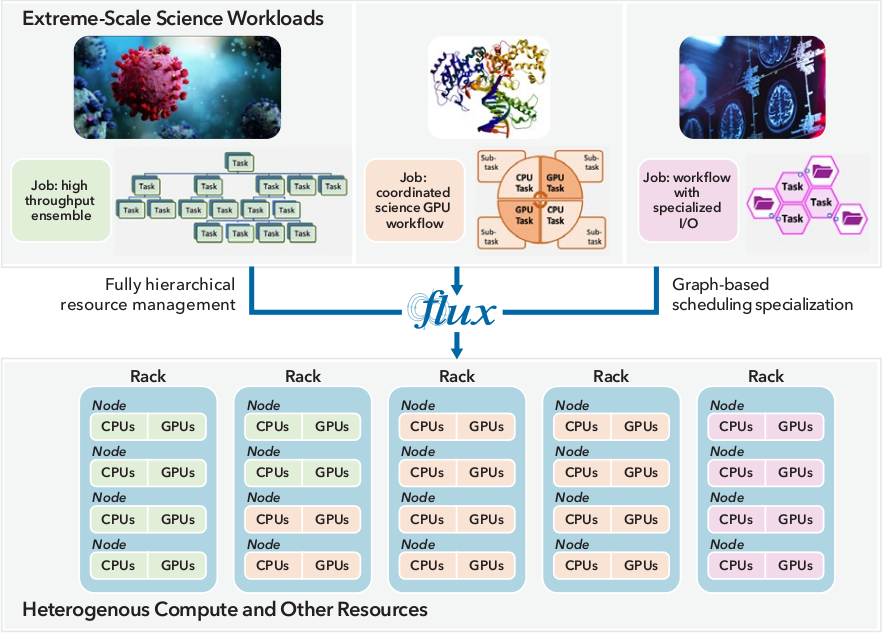
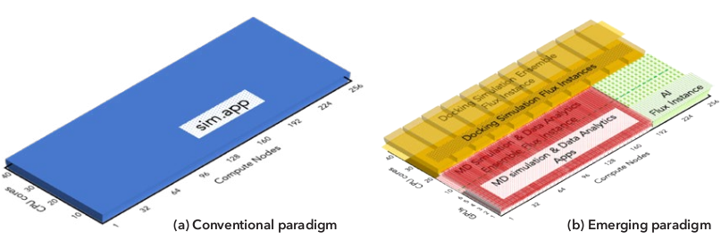
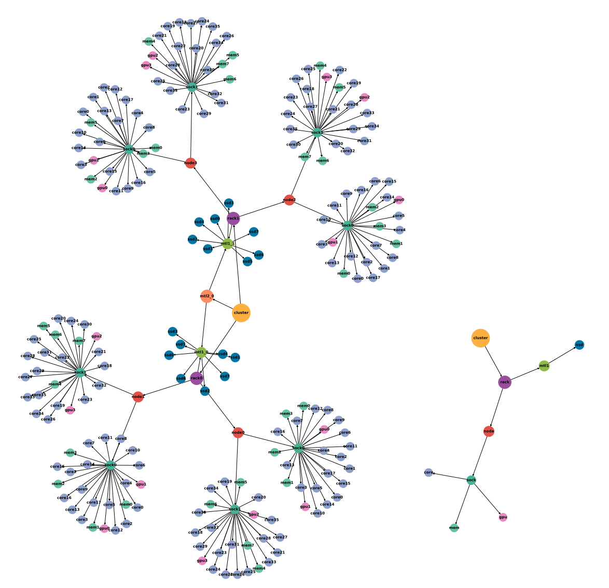
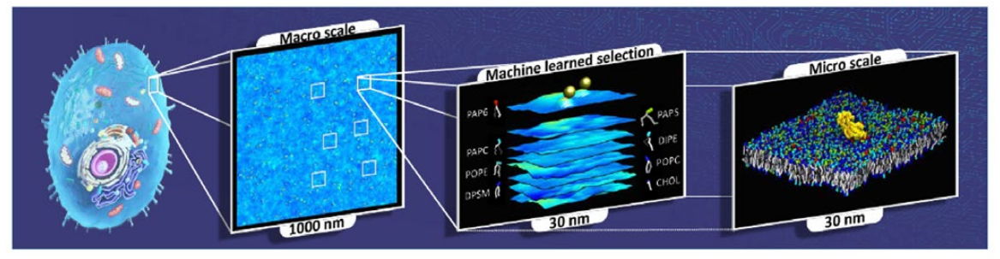
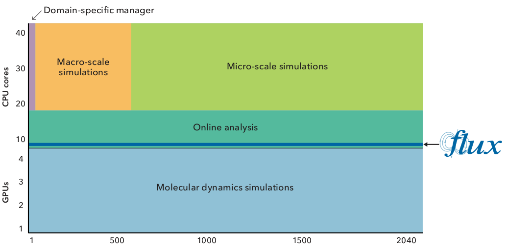
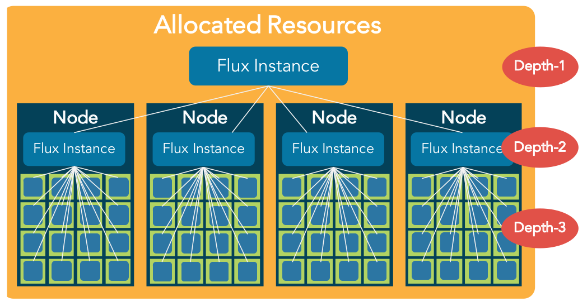
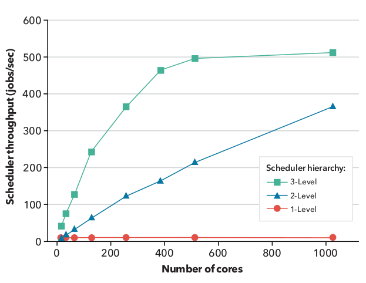
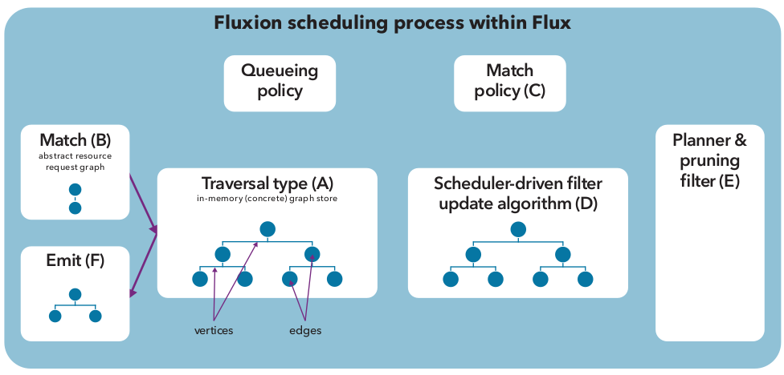

.. _flux-learning-guide:

###################
Flux Learning Guide
###################

.. note::
    This guide was prepared from the Flux R&D 100 Award Entry, published
    in 2021. For the original guide, see `here <https://ipo.llnl.gov/sites/default/files/2022-02/Flux_RD100_Final.pdf>`_.

******************
What does Flux do?
******************

Flux is a next-generation workload management framework for supercomputers,
high-performance computing (HPC) clusters, servers in the cloud and laptops.
Flux manages massive numbers of processors, memory and other resources of
a computing system and assigns the work requested by users—also known as
jobs or workloads—to one or more available resources that complete the work, a
method known as scheduling. A job is typically expressed in a script that contains
a formal specification that requests resources, identifies applications (e.g., multi-
physics simulation software to run simultaneously across resources) along with
their input data and environment, and describes how to deliver the output data.
Modern science computing campaigns of sufficient complexity require many such
jobs that contain numerous interconnected computational and other tasks. The
composition of numerous interdependent tasks that are spread across many jobs
as well as within each job is often referred to as a scientific or computing workflow,
distinguishing itself from a single job or workload.

Workload management software like Flux is critical for HPC users because it enables
efficient execution of user-level applications while simultaneously providing the HPC
facility with tools to maximize overall resource utilization. HPC centers typically
provide a wide range of computing systems on which scientific applications perform
computations. The workload manager is responsible for efficiently delivering
compute cycles of these systems to multiple users while considering their diverse
resource types—e.g., compute racks and nodes, central and graphics processing
units (CPUs and GPUs), multi-tiered disk storage. Figure 1 depicts how Flux
enables extreme-scale science.

However, two broad technical trends are making even the best-in-class products
significantly ineffective. The first trend is the evolution of workloads from HPC. With
the convergence of conventional HPC with new simulation, data analysis, machine
learning (ML), and artificial intelligence (AI) approaches, researchers are using
in new scientific discoveries, addressing our society's most pressing challenges. But
this evolution also produces computing workflows -- often compromising many distinct
tasks interacting with one another that are far more complex than traditional
products can sufficiently manage. Second, hardware vendors have steadily
introduced new resource types and constraints into HPC systems. Multi-tiered disk
storage, CPUs and GPUs, power efficiency advancements, and other hardware
components have gained traction in an era in which no single configuration reigns.
Many HPC architectures push the frontiers of compute power with hybrid (or
heterogeneous) combinations of processors, as in LLNL's Sierra supercomputing
and other pre-exascale systems. The workload management software
must manage and consider extremely heterogeneous computing resources and their
relationships for scheduling in order to realize a system's full potential.

   Figure 1: A complex HPC workflow - such as that for a drug discovery project - is composed
   of numerous interconnected tasks that are allocated and assigned to a diverse set of
   resources (e.g., racks, nodes, CPUs, GPUs, disk storage). Complex workflows can have
   varying resource requirements, interdependencies, and interaction patterns. With a growing
   trend toward higher complexity in modern workflows, HPC workload managers must effectively
   enable the scheduling and execution of their tasks and direct them to run on
   specific areas of the computing hardware. Flux provides a flexible and customizable 
   framework for workflows, both for HPC and the cloud. With its unique features, such as
   fully hierarchical resource management and graph-based scheduling, Flux enables 
   extreme-scale science.

Flux solves the key technical problems that emerge from these trends. It combines
fully hierarchical resource management with graph-based scheduling to improve the
performance, portability, flexibility, and manageability of the scheduling and execution
of both standard and complex scientific workflows on a wide range of HPC systems.

Fully Hierarchical Resource Management
======================================

Flux's fully hierarchical approach to resource management solves three primary
deficiencies of existing workload manager products in enabling HPC workflows.

First, every product provides its own interfaces to workflows, each of which is 
incompatible with the interface provided by the others. Every user of a workflow
must support every popular product, resulting in a multiplicative effort.
Instead, Flux is capable of managing resources from almost anywhere, including
on bare metal resources, virtual machines in the cloud, HPC resources allocated
by another workload manager product, or even on a single laptop. In practice, this
means a workflow can create its own Flux instance to manage and to schedule
allocated resources as if they were its personal supercomputer. Workflows can avoid
having to support all of the various products and instead be programmed directly in
Flux, leveraging Flux's flexibility to provide portability across multiple systems.

Second, most products only provide minimal support for a workflow when it needs
to divide its allocated resources among smaller tasks—a common requirement of
today's computing workflows. Specifically, these products allow a user to execute
multiple jobs within a workflow, but if those jobs contain many tasks, these solutions
make the user pay the cost of scheduling and executing those tasks. The limited
support for arbitrary sub-division of work within a job adds much higher complexity
to users' workflow software, slows its rate of development, and significantly limits its
robustness and execution performance.

By contrast, Flux can recursively create nested instances of itself, which in turn aid
in managing and scheduling a subset of the parent instance's resources. This means that
large, complex workflows can easily and automatically sub-divide their jobs into arbitrarily
small tasks and still rely on the workload manager to schedule their work 
efficiently and scalably. This capability greatly simplifies workflows, reducing their
arbitrarily small tasks and still rely on the workload manager to schedule their work
code maintenance burden while also improving their performance.

Third, traditional solutions assume that tasks within a workflow are independent and require little
to no coordination or communication, creating an artificial 
barrier between different tasks. Modern HPC workflows are increasingly coupling
simulations with in situ analyses or machine-learning and AI models, where the
results of a simulation are analyzed in real time in a separate task. In order for a task
to coordinate with another task within the same workflow (e.g., in situ analysis) it
must often resort to solutions with many side effects to overcome this barrier.

With the innovation of Flux, jobs or tasks can connect to one another through
messaging overlays and datastores built directly into Flux - a feature that significantly
facilitates communication between jobs, breaking down the coordination barrier. In
addition, Flux lets users configure and monitor all jobs and instances related to their
workflow through the command-line and programming interfaces.

Figure 2 visually contrasts the complexity of the conventional and new or emerging
HPC paradigms in terms of how they utilize the resources allocated by the system's 
workload manager. Nearly all existing products were designed when the workflows
were much simpler as shown in Figure 2a. Yet, these solutions have significant
difficulties with emerging paradigms exemplified by Figure 2b, as well as with
connecting and coordinating jobs. These problems have led users to develop their
own ad hoc custom scheduling and resource management software or use tools that
perform only workflow management or only scheduling. However, accomplishing 
sufficient job coordination without first-class support from a workload manager
like Flux has already proven to be difficult for either approach. Perhaps more
importantly, developing and maintaining ad hoc management software—especially
in this era of ever-evolving HPC hardware architectures—has quickly become
prohibitively expensive for supercomputing application teams.

   Figure 2: An illustration of how the computing resources allocated to a job -- as granted by the HPC
   workload manager -- differs between conventional and emerging scientific workflows. The
   notional x-axes depict the compute node IDs allocated to the job and the y-axes depict the IDs of
   computing resources in each of these nodes. (a) The conventional paradigm requires only a single
   parallel simulation application to run. (b) The emerging paradigm often requires many different
   types of tasks such as ensemble of molecular dynamics (MD) parallel simulation applications
   and another ensemble of docking simulation applications along with in suti data analysis for the
   MD ensemble while these tasks are driven by an AI.
   

Illustrative Batch Script Examples
==================================

In a job script used by a simpler workflow, the user enters line 1 in Figure 3a to
submit a job script (line 2) to the system-level workload manager, requesting 256
compute nodes with 42 CPU cores each. This job script uses the allocated resources
under the conventional workflow paradigm (see Figure 2a), where the application
(i.e., ``sim.app``) is executed across 256 compute nodes simultaneously, which then
work together to perform a computationally challenging problem such as a physics
simulation. More specifically, 42 copies of the ``sim.app`` software will be launcher and
run on each of the 256 compute nodes, with one copy per CPU core.

Figure 3b shows a job script with multiple tasks submitted on a heterogeneous HPC
system. Notice this script still remains simple with Flux, requiring only a few more
lines within the script. Similar to the previous example, at line 1, the user submits
a job script (through lines 2–5) with a request of 256 compute nodes each with 42
CPU cores—now also with 6 GPU resources (``-g6``). When this request is granted,
Flux automatically creates a child instance that manages the requested resources.
This job script then uses this instance as, in effect, a dedicated supercomputer and
submits a series of sub-batch scripts to it. At line 2, the command ``run.dock.sh`` is
again submitted, requesting a subset of the resources: 254 compute nodes with 24
CPU cores each, and no GPU resources. When this script is assigned to this subset,
it will again spin up an even smaller Flux instance and run many smaller docking
simulation applications under it. Similarly, at line 3, another sub-job script is submitted
to this instance with a request of 192 nodes each with 18 CPU-core and all of the
GPU resources—this time to execute a combined set of molecular dynamics (MD)
simulations along with data analytics applications. Line 4 initiates the third sub-job
script that runs AI applications to accelerate certain part of this computation with
a request of 64 nodes, again each with 18 CPU-core and all of the requested GPU
resources. At line 5, ``flux queue`` directs the top-level batch script to wait until
all three sub-jobs will complete. To accomplish this under other more traditional
products, each different workflow team either develops its own ad hoc software or
relies on a separate workflow management software. The efficiency, robustness,
and scalability of these software solutions vary wildly; the user of each workflow
would need to find and read the documentation, learn about new interfaces, then
install and deploy them. These examples can become even more complex. What if
the first job needed to connect to, and remotely submit tasks to, the second job?
However, with Flux, such communication and coordination between distinct batch
jobs can be easily accomplished using the same interfaces—in fact, the user needs
only make a single line change to the first script in order to submit a new task such
as an AI re-training task remotely into the Flux instance managing the second job:
e.g., inserting ``FLUX_URI=$(JobID_3b_AI.sh) flux batch retrain.sh`` into
a line between 2 and 3 of Figure 3a. Based on this request, the first job uses the
connector built into the Flux instance of the second job, then channels the same Flux
commands to batch additional tasks or retrieve the status of the simulation run.

(a) Conventional batch job script (Figure 3a)

.. code-block:: console

    flux batch -N256 -n256 -c42 --wrap <<SCRIPT
      flux run -N256 -n10752 sim.app
    SCRIPT 

(b) Emerging batch job script  (Figure 3b)

.. code-block:: console

    flux batch -N256 -n256 -c42 -g6 --wrap <<SCRIPT
      flux batch -N256 -c24 run.dock.sh
      flux batch -N192 -c18 -g6 run.MD.sh
      flux batch -N64 -c12 -g6 run.AI.sh
      flux queue drain
    SCRIPT 

In the above, compared to a conventional request (a) a job request for an emerging HPC workflow (b) that divides up heterogenous resources
10,752 CPU cores and 1,536 GPUs - into multiple tasks still remains quite simple under
Flux as each task is recursively managed by a child Flux instance and a sub-job script.

Graph-Based Scheduling in Each Flux Instance
============================================

Workflow complexity quickly multiplies as distinct tasks of today's scientific
workflows often have vastly different requirements in resource types (e.g., CPU
or GPU), duration of resource usage, and the relationships among resources.
Furthermore, to satisfy new resource demands made by ambitious scientific
studies and interdisciplinary research, HPC systems continue to increase in size
and integrate numerous types of processing elements situated locally and in the
cloud. As systems become larger and more diverse, they also become dynamic:
Hardware and software components can vary as they are disused, fail, or change
price. Managing complex combinations of resources that change over time requires
elevating resource relationships to an equal footing with resources themselves.

Current-generation workload management products are designed to manage static,
homogeneous HPC systems of the past, and their representation of resources
reflects this rigid thinking. Data management and storage structures designed for
efficiently representing compute-node-centric hardware resources do not encode
complex and changing relationships (e.g., power capping, network flows, location),
which makes them incapable of representing important components of newer
heterogeneous, dynamic systems. Flux overcomes the limitations of current products
by basing its resource representation (a model for characterizing resources) on a
directed graph - a powerful and expressive structure capable of dynamically defining
arbitrary resource types.

A directed graph is an abstract mathematical structure that associates objects
(vertices) via directed relationships (edges). For example, a social media network is
a directed graph; users are vertices, and communications between two users are
edges where direction can be defined by the user who first contacts the other. In
the case of Flux, a vertex can be a hardware resource (e.g., a CPU or compute node),
and an edge can indicate containment (i.e., a server contains a CPU). Figure 4 is a
visual representation of resource vertices and edges in a system with multi-tiered
disk storage that can be allocated as a global pool or with respect to the distance
(measured in number of edges) from other resources (e.g., a core). Matching a
resource request consists of descending into the graph and checking vertices for
suitability. Specifying different vertex and edge structure allows for tremendous
request flexibility: Selecting solid-state drives in Figure 4 via a path through a rack
(e.g., purple vertex rack0 to green vertex mtl1_0) versus through mt1l2_0 (orange
vertex near the graph center) permits priority based on proximity which is extremely
difficult for current-generation schedules to replicate. The ability to allocate
resources in different ways based on paths is a unique capability of Flux, and one
that is necessary for the upcoming El Capitan exascale system at LLNL.

Using a directed graph as a foundation for resource representation provides Flux
with several key capabilities. The abstract model facilitates tremendous flexibility:
Any type of resources (e.g., hardware, software, power distribution units) can be a
vertex, and relationships between vertices are well-defined. Hierarchical scheduling 
assumes an elegant form when based on a directed graph model. Each Flux instance
manages and schedules a subgraph (subset of the vertices and edges) of the resource
graph, where a child instance's purview is a subgraph of its parent. Furthermore, a
tremendous number of algorithmic techniques and optimized software libraries exist
for performing fast operations on directed graphs. By basing its resource model on a
directed graph, Flux integrates the fruits of algorithmic development to perform many
required operations: e.g., quickly checking resource states, scheduling allocations,
adding/removing resources, and transforming representations.

   Figure 4: A directed graph of the multi-tiered storage test system's vertices and edges shows relationships
   between different resources such as disk storage nodes and GPU processors. Flux uses
   this mathematical model to coordinate job allocation among resources, ultimately ensuring
   an HPC workflow executes in the most resource-efficient way. The smaller graph on the right is an example
   of a resource request that is matched in the resource graph.   

Scheduling operations are basic procedures in the context of directed graphs.
To request a resource allocation, users specify their needs in a common markup
language. Flux transforms the request into a directed graph, which it uses as
a template to find matching resources in the system resource model. Finding
resources amounts to checking resource vertices for availability, which Flux performs
with its highly optimized implementation of depth-first graph search. Depth-first
search is a ubiquitous technique for traversing each graph edge to the end (i.e.,
depth) before searching other edges.

The future of computing requires flexibility and dynamism, and the ability to change
the graph model in any way at any time is one of Flux's primary features. Adding or
removing resources is a straightforward matter of graph editing through well-known
techniques for inserting or deleting subgraphs. Unlike existing products, Flux permits
dynamic transformations of its resource model without manual reconfiguration and
restart of the scheduler, which enables automated changes in resource relationships
and addition or removal of resources. Mutability at-will is essential for supporting
dynamic systems, as the traditional approach of accounting for every possible type
of resource in each conceivable configuration is intractable. Complete flexiblity of
expression coupled with true dynamism and efficient resource allocation allows Flux
to integrate and manage any resource representable by a directed graph at any time.

Flux Enables Extreme-Scale Science and Engineering
==================================================

Spurred by the growing convergence of conventional HPC and new simulation, data
analysis, and ML/AI techniques, the computational science community has been
embracing much more diverse workflow solutions than ever before. These trends
are already pushing the limits of the existing workload management products.
Flux has been able to provide innovative solutions. Furthermore, our development
team brought a co-design strategy to early scientific use cases, resulting in feature
enrichments and further performance and scalability improvements. With the
first-class workflow-enabling support of FLux, the software complexity of domain-
specific workflow management software was greatly reduced, often to just a thin
wrapper around Flux, and the overall end-to-end performance and scalability
of workflows were significantly improved. This section highlights some of the
representative scientific and engineering workflows that Flux has enabled.

Cancer Research
---------------

The JDACS4C program—Joint Design of Advanced Computing Solutions for Cancer—
is a partnership between the Department of Energy (DOE) and the National Cancer
Institute to advance cancer research using emerging exascale HPC capabilities. The
Pilot 2 project within JDACS4C seeks to develop effective HPC simulation methods
to uncover the detailed characterizations of the behavior of RAS proteins on cellular
membranes. The RAS protein family are small GTPase-signaling proteins involved
with the control of cell division and growth. Mutations leading to increased RAS
activity contribute to a wide range of cancers, and up to 30% of human cancers are
linked to mutations in the RAS gene family. RAS proteins typically signal their
downstream effectors when bound to the lipid bylayer of cellular membranes, and
drugs that inhibit RAS activity do not exist yet.

Resolving RAS membrane dynamics and aggregation is a difficult task as a micro-
scale length and time scales are needed; yet micro-scale molecule-level details are
also required to capture protein–protein and protein–lipid interactions. To resolve
RAS structure and dynamics on cellular membranes, the Pilot 2 team developed the
Multiscale Machine-Learned Modeling Infrastructure (MuMMI), which can sample
data at the macro-scale with effective micro-scale resolution. This process is depicted
in Figure 5.

A macro model is simulated at the membrane level with 300 RAS molecules, which
is then coupled with an ML module that drives the sampling of patches, small
neighborhoods around an RAS molecule. These patches are then used to instantiate
and run corresponding MD simulations.

   Figure 5: Addressing many important biological questions requires large length- and time-scales, yet at the
   same time molecular detail levels. Flux scalably and portably enables the MuMMI workflow to simulate
   protein-lipid dynamics for a 1µm x 1µm membrane subsection at near-atomistic resolution.
   

The MuMMI workflow reveals many workload management challenges for workload 
managers on pre-exascale machines. These difficulties include needing to co-
schedule and to coordinate coupled simulation applications at different scales in a
highly sophisticated manner. Specifically, it co-schedules macro models with several
thousand MD simulations along with an ML module that prioritizes simulations
dynamically at a high rate anda  data store to coordinate the data flow between
different tasks running on CPUs and GPUs. Figure 6 shows how the MuMMI workflow
used Flux to help schedule and execute various types of applications at large scale.

Owing to Flux, MuMMI's multi-layered, high throughput simulation workflow could
efficiently and effectively proceed by thin domain-specific workflow-management
software tools, a combination of LLNL-developed software system called Maestro
and an ML-based tool that is coupled closely to the macro simulations.
Specifically, the ML-based tool processes simulation frames and decomposes each
frame into hundreds of patches, one for each RAS. These patches are scored by its
pre-trained machine-learned model. The most “interesting” candidate patches—
ones with highest scores—are fed to micro-scale MD simulation tasks, which are
submitted, scheduled and executed by Flux.

   Figure 6: The award-winning MuMMI project utilizes heteregenous CPU/GPU resources to perform
   different complex simulation and decomposition jobs simultaneously. Shown here are the number
   of processors used for a typical MuMMI run of 2,040 nodes on LLNL's Sierra supercomputer. Flux
   and complementary workflow software tools have a small footprint, taking up only a small 
   fraction of the compute resources allocated to a MuMMI run (e.g., a single CPU core on each node).
   

In a departure from the traditional products, Flux provides many knobs
to specialize and tune its scheduling policies so that it can deliver the best
performance for each different type of workload. In the case of MuMMi's, Flux's
job queuing capability is first specialized to a first-come, first-served (FCFS) policy.

A typical facility-wide workload manager's scheduling policy requires the scheduler
to look ahead at all later jobs to find backfilling opportunities when the current job
cannot be scheduled, which is computationally expensive and time consuming.
With Flux, the queue depth is easily set to 1; the scheduler only looks ahead to
the next job. This FCFS policy with a single-unit queue-depth parameter keeps the
scheduling performance overhead at bay - an optimization well-suited for MuMM's
high-throughput workload. Considering only a few jobs when making a decision of
what to run would be inappropriate for center-wide scheduling that must maintain
fairness among many users.

Flux is further specialized to perform its scheduling at the granularity of CPU/GPU
level instead of at the exclusive node level—again a typical center-wide scheduling
policy - to fulfill MuMMI's complex scheduling requirements. Additionally, to
accelerate scheduling and reduce the number of waiting jobs maintained by a single
Flux instance, Flux's hierarchical policy is specialized to launch a child instance on
every compute node. The eight jobs related to the four micro-scale simulations
running on each node are managed through this local instance. Overall, running on
all of Sierra's 4,000 nodes, FLux allows MuMMI to utilize 16,000 GPUs and 176,000
CPUs efficiently at peak, simultaneously running 16,000 micro-scaled MD simulations.

In November 2019, the MuMMI team won the SC19 Best Paper Award for this
innovative computing workflow approach that enables a new genre of cancer
research. The research team has continued to adopt Flux's newer features, and
they successfully ran the next version of MuMMI on the full scale of the Summit
supercomputer at Oak Ridge National Laboratory (ORNL) in March 2021.

Combating the COVID-19 Pandemic
-------------------------------

Near Real-Time Scenario Modeling
^^^^^^^^^^^^^^^^^^^^^^^^^^^^^^^^

Amid the COVID-19 pandemic, scientists have demanded complex scientific
workflows to a greater degree than ever before. Combating the new global crisis has
required U.S. computing leaders at federal agencies and within the DOE complex to
partner with leading universities and technology firms worldwide. As a result, large
computing facilities have seen an unprecedented surge of diverse and complex
workfows. Many multi-disciplinary research teams have been successfully using Flux
to enable major COVID-19 research workflows.

COVID-19 spread modeling is an important class of scientific computing workflows
as nations urgently need to predict the spread of this virus under various scenarios
and inform decision makers. For example, a collaboration among LLNL, Los Alamos
National Laboratory, and the National Energy Research Scientific Computing Center
(NERSC) in which a large workflow consisting of an ensemble of EpiCast epidemiology
simulations is employed to model COVID-19 spread patterns and to inform federal
agencies like FEMA of the prediction. As part of the National Virtual Biotechnology
Laboratory (NVBL), their workflow taps into U.S. census data to model scenarios such
as how the virus will spread if schools are open two days a week.

Flux is playing a central role in providing high job throughput performance and
portability required for urgent decision making. Flux's fully hierarchical resource
management allows this class of workflows to run many modeling application tasks,
each with a different scenario, efficiently at once on a large resource allocation.
With strict deadline requirements, these workflows must also portably leverage
computing resources from multiple institutions include the world's most powerful
supercomputers at ORNL, LLNL, and NERSC. Existing software tools (e.g., Slurm
and IBM LSF fall short of meeting all of the project's requirements - high job
throughput, co-scheduling ability, and portability between different HPC systems. Luc
Peterson, software architect of a main tool used for the NVBL team reported, "With
Flux, we can model one scenario with UQ [uncertainty quantification] for the entire
country in about five minutes on a few [Lassen supercomputer] nodes - that is, near
real-time feedback.” This allowed U.S. policy decision makers to be informed of the
results of COVID-19 spread modeling including confidence levels with no delay.

Fast ML-Based COVID-19 Antiviral Drug Design
^^^^^^^^^^^^^^^^^^^^^^^^^^^^^^^^^^^^^^^^^^^^

In May 2020, a multidisciplinary LLNL team set out to develop a new highly scalable,
end-to-end antiviral drug design workflow that could expediently produce potential
COVID-19 drug molecules for further clinical testing. This team brought together
multiple scientific experts.

• LBANN (Livermore Big Artificial Neural Network Toolkit) researchers focused on developing a scalable ML technique to construct a high-quality ML model using 1.6 billion chemical compounds.

• ATOM (Accelerating Therapeutics for Opportunities in Medicine) researchers coupled this ML model with a generative molecular design (GMD) pipeline to increase the probability of creating new COVID-19 antiviral drug molecules with desired properties (e.g., diversity, validity, efficacy, safety).

• ConveyorLC researchers focused on coupling the above with their HPC simulations that evaluate the docking properties of the newly generated drug candidate molecules—that is, searching for an appropriate ligand that both energetically and geometrically fits the target protein's binding site.

• Workflow infrastructure researchers devised workflow management techniques to ensure the scalability of this newly envisioned coupled workflow.

The team quickly discovered that creating an end-to-end solution based on
existing components could present two workflow issues - and that Flux could
comprehensively solve them. First, the ConveyorLC docking simulation implements
its own ad hoc task scheduling on top of message passing interface (MPI)
functionality, which is not scalable. The team discovered that the scalability of this
scheme indeed led to a significant resource utilization loss starting at 50 nodes. At
200 nodes, the highest scale evaluated with this scheduling scheme, resource utilization
had already dropped to 45.5%. The second workflow challenge was that the GMD pipeline, a
domain-specific workflow management tool, has never been scaled to a
few compute nodes and beyond. Taken together, the ideal solution must be capable
of utilizing large numbers of compute nodes by flexibly running many ConveyorLC
tasks simultaneously each at a small scale (25 nodes) but still exposing this ensemble
of tasks as a single unit to GMD to overcome its scalability.

Flux's fully hierarchical resource management has proven to be sufficiently scalable
and flexible to solve both of the project's key workflow problems. For example,
a large Flux instance managed ConveyorLC docking simulations as an ensemble,
then submitted each docking simulation as sub-batch jobs running on their own
small Flux instance to the parent instance. Using this hierarchical scheme, the team
showed that docking achieves 98.98% resource utilization in the composite workflow
context on 2,950 nodes of LLNL's Quartz supercomputer.

Overall, Flux enabled the scalable end-to-end workflow architecture that is used for
massive ML training. This team's massive training work was nominator for a
special category of the 2020 ACM Gordon Bell Prize,6 and was named one of the four
finalists. The team plans to submit the workflow-focused work to the same category
of the ACM Gordon Bell Prize in 2021.

Engineering & Design Optimization
---------------------------------

Uncertainty Quantification (UQ); Verification & Validation (V&V)
^^^^^^^^^^^^^^^^^^^^^^^^^^^^^^^^^^^^^^^^^^^^^^^^^^^^^^^^^^^^^^^^

UQ is the science of quantitative characterization and reduction of uncertainties
in both computational and real-world applications. Its goal is to determine the
likelihood of certain outcomes if some aspects of the system are not precisely
known. V&V are independent procedures used together to check that a product,
service, or system meets requirements and specifications and that it fulfills its
intended purpose. In the context of HPC workflows, these methods often share a
common pattern: They must run a large ensemble of physics and other simulations
on a supercomputer.

The traditional approach is to write a simple script that iterates through the many
necessary job scripts and submits each as a job to the system workload manager.
However, this approach has several drawbacks. First, system workload managers
often impose limits on the number of concurrently running jobs that a single user
can have, so throughput will be low and the user will have to wait a long time for
their jobs to complete. Second, users with a large number of jobs will quickly be
inconvenienced by submitting and monitoring all of the jobs, resubmitting them if
they fail, and then running the post-processing script once they have all completed.

Domain-specific workflow management software tools such as LLNL's UQ Pipeline
(UQP) offer an alternative approach. UQP's main advantage is provisioning a
resource allocation consisting of N nodes much more quickly than provisioning N
resource allocations, each with one node, from the system workload manager. UQP
then subdivides the remaining allocated nodes into N uniform "slots." Each slot
executes one of the N ensemble simulations. Unfortunately, domain-specific tools such as
as UQP require that the information contained in the batch-job submission script
(written for the system workload manager) be re-implemented into the particular
workflow management tool and subsequently submitted to the ad hoc scheduler
within these tools. As a consequence, users must learn and port their code to each
different tool whose performance and robustness vary wildly. These redundant
implementations within each of these tools are becoming prohibitively expensive to
develop and support.

Flux recently allowed UQP, one of the most important tools for UQ and V&V
workflows at LLNL, to overcome its disadvantages. The team's design extended Flux's
fully hierarchical resource management and graph-based scheduling capability to
provide the requisite job throughput performance without relying on their ad hoc
solution. Based on this unified approach, they created a domain-specific workflow
tool component called Themis as a thin wrapper around Flux. With Flux, Themis was
demonstrated to complete a 1-million-member ensemble simulation, which was not
possible before.

Additive Manufacturing (AM)
^^^^^^^^^^^^^^^^^^^^^^^^^^^

AM is revolutionizing the manufacturing industry, allowing construction of complex
machine and material parts not readily fabricated by traditional techniques. Although
the industry has had significant interest and investment in AM, the fraction of this
investment devoted to computer modeling and simulation is relatively small and
focused on reduced-order models for industry use instead of the development of
high-fidelity predictive models. As part of the DOE's Exascale Computing Project, the
Exascale Additive Manufacturing Project (ExaAM) represents a unique opportunity
to use exascale computer simulations to enable the design of AM components with
location-specific properties and acceleration of performance certification. ExaAM aims
to incorporate microstructure evolution and the effects of microstructure within AM
process simulations directly into an end-to-end HPC workflow.

The ExaAM team expressed interest in Flux and met with us in September 2020
to co-design the project's overall workflow using Flux. Flux's hierarchical resource
management capabilities were tested on a portion of the workflow called ExaConstit
to evaluate potential benefits. By November, the ExaAM team was able to integrate
Flux into ExaConstit and reported a 4x job throughput performance improvement with
simple scripting changes—namely, submitting multiple batch-job scripts into a Flux
instance on a large allocation instead of using the system's native workload management.
ExAM team member Robert Carson noted, "The workflow change [to integrate Flux]
is surprisingly small. In my Python script that generates all of these things, I only had
to add about five additional lines for the Flux path."

Large AI on HPC
---------------

Flux has enabled extremely large AI workflows for LLNL's Machine Learning
Strategic Initiative (MLSI) project. As part of LLNL's Laboratory Directed Research
and Development Strategic Initiative portfolio, MLSI aims to combine simulations
with experiments using ML to optimize the design of key devices used in National
Ignition Facility. Similar to MuMMI and UQ workflows, the MLSI ML workflow requires
extremely high job throughput, co-scheduling capabilities, and dynamism. To
overcome these workflow challenges, a new workflow tool called Merlin was
developed under MLSI.

Merlin provides an adaptable, efficient Python-based workflow that runs an
ensemble of simulations and records the results while concurrently running ML on
the results as they become available. The ML model then helps steer the ensemble
of simulations as it improves (or learns) with more data. The workflow executes a
variety of tasks to generate and analyze the data. The first of these is defining the
spatial domain needed for creating a unique set of data describing the domain. An
executable task will accept the sample set as input parameters and produce data for
the ML model. The simulation can range from a simple ordinary differential equation
to a massively parallel hydrodynamics simulation. These simulations may also be run
on many different platforms with different workload managers, where scheduling
and launching the simulations in a general manner becomes difficult.

The first version of the Merlin MPI parallel job launcher used a simple Python-
based subprocess call to map a set of MPI parameters (e.g., number of nodes and
CPU cores) onto the commands needed for launching under the system workload
manager such as Slurm or IBM LSF. A maintenance issue arose when each new
workload manager required a set of runtime parameters that do not map 1:1
between the various launch systems. Moreover, IBM LSF does not handle nested
launches where there is one subprocess call for the allocation and a subsequent
call for the simulation. Some parallel runs need CPU/GPU support, while others
require only CPU cores. This requirement puts the onus on the workload manager to
schedule resources for the various types of parallel jobs.

In Merlin, Flux solves both the nesting issue and co-scheduling issue through the
use of a single Flux instance. Jobs can be concurrently scheduled because the single
Flux instance tracks all available resources with a GPU/CPU-level scheduling policy.
Nesting is not an issue with this single instance. The initial Flux-Merlin integration
was designed and implemented on an LLNL Linux cluster. Porting it to other
platforms, such as Sierra and Lassen supercomputers, was straightforward. Overall,
the integration team was able to generate massive amounts of simulation data from
100 million short-running jobs, thanks to Flux.

Broad Applicability and Adoption
================================

Because the workload manager is among the most critical software elements for
large supercomputers, computing centers must often undertake a multi-year,
phased effort to adopt a new system-level, multi-user workload manager to replace
their existing solutions on large HPC systems. Flux can be run in both multi-user and
single-user modes to facilitate a smoother, incremental adoption: Specifically, Flux's
user-level capability called single-user mode interoperates easily with other traditional
solutions and this has proven to be essential for enable time-critical workflow
problems on the world's largest and most powerful supercomputers even before
multi-user mode is deployed.

Figures 3a and 3b provide simple examples. We first note that the first lines
these scripts are nearly identical to that of traditional solutions. Exploiting this
property, Flux can easily be adapted and used with a computing center's existing
system workload managers with just a few keystrokes. For example, Figure 7 shows
how Flux can enable the complex workflow in Figure 3b under Slurm, a traditional
HPC workload manager, with just a two-line change in commands. This feature
has proven to be critical in helping combat time-critical workflow problems such as
as in COVID-19 research. Thanks to this easy-to-adapt feature, Flux has enabled
HPC users, research and industry collaborators, and computing centers to be able
to respond to the needs of emerging workflows without having to adopt the full
system-instance technology of Flux.

.. code-block:: console

    sbatch -N256 -n256 --wrap="\
        srun -N256 -n256 flux start <SCRIPT in figure 3b>

The above is Figure 7, and shows that enabling Flux under another workload manager like
Slurm is as simple as executing this two-line command.

Flux's adaptability to different use cases, along with being open source, has
spurred wide adoption outside of LLNL. Flux has users worldwide including our
collaborators in both U.S. and European academic institutions; U.S. national labs;
U.S. military and federal agencies; and prominent domestic and international
scientific computing and HPC centers like NERSC in California and RIKEN in Japan,
home of the top-ranked Fugaku supercomputer. Figure 8 shows the geological
distribution of these institutions.

.. figure:: images/figure-8.png
   :alt: Users are collaborators of Flux are quickly expanding around the world.
   :align: center

   Figure 8: Users are collaborators of Flux are quickly expanding around the world.
 
 
*******************
How does Flux work?
*******************

Fully Hierarchical Resource Management Techniques
=================================================

Flux's innovative fully hierarchical resource management capabilities drastically
improve scalability and flexibility through a divide-and-conquer approach (Figure 9).
Jobs and resources are divided among the schedulers in the hierarchy and managed
in parallel. Figure 10 shows how this approach drastically increases the scalability of
Flux over traditional schedulers that rely on a single, centralized process.

Three distinct principles underpin Flux's hierarchical design:

• *Hierarchical Bounding Principle*: A parent Flux instance grants job and resource allocations to its children.
• *Instance Effectiveness Principle*: Each Flux instance can be configured independently and is solely responsible for the most effective use of its HPC resource set.
• *Arbitrary Recursion Principle*: The first two principles apply recursively from the top of the resource hierarchy (e.g., the entire HPC center) down to any arbitrarily small subset of resources.

   Figure 9: As a fully hierarchical workload manager, any Flux instance can spawn child instances to aid
   in scheduling, launching, and managing complex sequences of compute jobs. A top-level Flux instance
   (parent) is created within a 4 node resource allocation; the top-level instance then spawns additional
   levels of Flux instances (children), each of which manages a smaller subset of jobs and resources.
   The hierarchy of Flux instances extends down until the lowest-level instances each manage a single code -
   a maximal example of full hierarchical capabilities.

Hierarchical bounding improves scalability in two ways. First, it reduces the number of
resources that each Flux instance must consider, which improves the performance of
each individual instance. Second, it enables Flux instances to delegate work to child
instances, spreading the load across many independent instances and ultimately
improving their collective performance.

Instance effectiveness enables the customization of Flux instances for specific
workflows. The top-level Flux instance may be a system-wide, multi-user workload
manager instance with expensive scheduling policies, but it can create a child 
single-user instance for each new workflow which enables the workflows to customize the
scheduling and other policies to their exact needs. This customization includes not
only the scheduling policies and configuration scheduling parameters, but also the
number of children that the Flux instance creates.

Arbitrary recursion amplifies the scalability and flexibility provided by the previous
two principles. It allows for the creation of the appropriate number of Flux
instances for each workflow. Specifically, this principle enables large ensemble
workflows to create more Flux instances and thus improve job throughput with
minimum performance overhead needed for parallelization. Flux instances within
a hierarchy can even be dynamically created and removed depending on how
workloads change over time.

   Figure 10: For multiple runs on between 1 and 1,152 cores of LLNL's Quartz supercomputer, three different configurations
   of schedulers are benchmarked on a 4,096 job-workload. First, a traditional workload managed (red) schedules the
   workload at the same rate regardless of the number of cores. Second, two levels of Flux instances (blue) with the
   second level instances each managing 32 cores, schedule the workload 45x faster than the traditional workload
   manager (red) and scales well with the number of cores. Finally, three levels of Flux instances (green) with each third-level
   instance managing a single core, maximizes throughput at 60x faster than traditional techniques (red) and scales
   excellently with the number of cores.
   
   
Scalable Graph-Based Scheduling Techniques
==========================================

Once instantiated, Flux effectively carries out many complicated operations
ranging from monitoring the health of resources, to enqueuing submitted tasks,
to scheduling and executing these tasks. Flux uses a graph-based approach to
scheduling as described earlier. Flux's scheduler component, called Fluxion, is
represented in Figure 11. During Flux instance initialization, Fluxion first populates
an in-memory resource graph store (A) comprising vertices that represent the HPC
system's various compute resources and edges that represent the relationships
among those resources. The initialization process also includes the selection of the
graph resource's representation granularity and traversal type if users decided
to use non-default. Once initialization is complete, Fluxion is ready to receive the
jobs' resource requests from Flux's core framework.

Flux first constructs a job's resource request in the form of an abstract resource
request graph (B). The abstract request graph generally specifies the job's resource
requirements in terms of both node-local resources (e.g., amount of compute cores
and memory to be used) and higher level or even global resources (e.g., compute
racks, network switches, power, parallel filesystem bandwidth). The abstract request
graph then becomes the input for the selected graph traverser (A) to find its best-
matching resource vertices and edges. The traverser “walks” the concrete resource
graph store in this pre-defined walking order and matches the abstract request
graph to the concrete resource graph.

   Figure 11: Fluxion, Flux's scheduler component, automatically performs multiple steps when a Flux instance is initialized. 
   See text for a description of each lettered process.

As shown at (C), the best-matching criteria is determined by the match policy within
Flux's traverser. The policy is invoked every time the traverser visits a vertex. The
policy then evaluates how well a given resource vertex matches with the abstract
request graph and scores it accordingly. Flux's resource model must also efficiently
keep track of the status changes of resources over time in order to support various
queuing and backfilling policies common to HPC job scheduling (e.g., EASY and
conservative backfilling policies). Thus, the model integrates a highly
efficient resource-time state tracking and search mechanism into every resource
vertex. This mechanism (and a simple abstraction) is called Planner (E).

After judicious selection of the appropriate representation granularity for the
concrete resource graph—striking a balance between performance and scheduling
effectivenes - the resulting graph can still be quite large when modeling high-
end systems. Thus, the Fluxion scheduler includes other scalability strategies in its
model, such as pruning filters (E). For example, pruning filters can be installed at
high-level resource vertices (e.g., compute racks) to track the amount of available
lower-level resources (e.g., compute cores) in aggregate, which reside somewhere
in the subgraph rooted at that vertex. Fluxion also introduces a novel scheduler-
driven filter update algorithm (D) that updates and maintains these filters
without incurring high performance overhead. This filter significantly improves
performance by pruning the required graph search. Finally, once Fluxion determines
the best matching resource subgraph, this is emitted as a selected resource set
representation at (F). Flux's core framework can then make use of this resource
set to contain, bind and execute the target program(s) within those resources. As
discussed earlier, our graph-based techniques stray away from the traditional
workload managers, helping usher in the era of extreme resource heterogeneity
for HPC. The existing solutions use rather simple, compute-node centric data model
and scheduling schemes.

User Interfaces
===============

Existing workload manager products typically provide only a command-line interface
(CLI) as their primary user interface. Some of the more popular workload managers are
bolstered by community efforts to support application programming interfaces (APIs) so
that other software can more efficiently interoperate with them, but these community efforts
are ad hoc, poorly supported, and thus usually short-lived. On the other hand,
Flux provides both a CLI as well as first-class API support for the common programming
languages C, C++, Python, and Lua. Work-in-progress support for the programming
languages Rust, Go, and Julia has also been added. These APIs enable developers from many
programming backgrounds to interoperate easily ande efficiently with Flux. Furthermore,
because these interfaces are provided as a core part of Flux, users can rely on their
continued support.

Flux's Python support is particularly important due to the proliferation of Python-based
worfklow management systems. Many of them leverage Flux's Python API to directly
integrate with Flux, including Maestro, Themis and GMD, Radical Pilot, and Parsl.
As a workflow management system, integrating via an API as opposed to a CLI is both
significantly easier - accessing the functionality is a direct call 
to Flux as opposed to an indirect call—and more performant—there is no need to create a
new program for the CLI command or to perform any string parsing of the CLI output.

Single-User Mode
================

A unique and novel feature of Flux is that it allows for both single-user and multi
user modes. Most HPC users are familiar with the multi-user mode when interacting
with the workload manager. Similar to a traditional solution, in this mode, decisions
are made at the system-level, and requests from multiple users are honored through
individual allocations based on priorities, accounts, and well-known scheduling
policies such as EASY and conservative backfilling and fair sharing.
Authentication between users as well as exclusive access to resources are important
criteria in this mode. Here, the goal is to ensure that the resources from the entire
cluster are shared among users in a fair and equitable manner, that user requests
for allocations are met without starving any job, and while optimizing for high
node utilization and low fragmentation. Conventional workload managers do not
provide users with the comprehensive ability to manage resources within their own
allocation. Traditionally, users are assumed to rely on the policies set by the system
administrators within their allocation. The consequences of this limitation include
the emergence of ad hoc scripting; "glue" code (i.e., written solely for the purpose
of filling a gap or overcoming a limitation); and various workflow managers that
attempt to streamline the complexity of scientific applications that need coupling,
coordination, and dependency management, as discussed previously.

Flux provides a single-user mode, where users have the flexibility to manage
resources and tasks within their allocation. This allows users to set up their own
customized hierarchies as well as policies based on the graph-based resource
model. This also allows users to tune additional scheduling options such as queue
depths an throttling of jobs. For example, an ensemble-based workflow that 
encompasses thousands of short-duration, single-core jobs can spin up a network
of nested Flux instnces each with an FCFS policy, instead of relying on the system's
default policy of FCFS plus backfilling, which may not be necessary for the user's
workflow. Such a network of child Flux instances is also more scalable and fault
tolerant, as it can easily absorb the stream of thousands of incoming jobs without
becoming overwhelmed.

Similarity, for complex workflows with many dependencies and steps, users can set
up a customized, coordinated network of Flux instances to facilitate communication
between various tasks in the workflow in a scalable manner. Users could choose
to divide their node in a manner where some tasks run on the heterogeneous
components such as GPUs while other tasks of the application can utilize the CPUs,
thus leveraging co-scheduling techniques.

Flux's single-user mode enables such customization with ease and supports diverse
workflows and resources, which is not possible to accomplish with traditional
solutions. The single-user mode is a distinguishing feature of Flux that gives
enormous flexibility to the users, allowing them to derive maximal performance and
utilization within their allocation for their specific use case.

Multi-User Mode
===============

Like traditional workload managers, Flux also provides a multi-user mode. In this
mode, Flux runs as a privileged account, accepts jobs from multiple users, sorts and
schedules the jobs based on user's priorities, and finally executes each job as the
submitting user. Similar to other products, Flux includes an accounting component
to keep track of users' resource usage relative to their priority and job prologue and
epilogue scripts that enable admins to customize Flux to their sites.

Unlike traditional solutions, Flux has three key architectural designs that make its
multi-user mode very secure. The first is which parts of Flux run as root - the highest
level of privilege on a computer. Typical workload managers run their entire software
as root, meaning that any security vulnerability in the solution can be used to easily
gain total control of the system. Flux breaks this mold with its Independent Minister
of Privileges (IMP), which is the only component of Flux that runs as root. Every
other Flux component runs as a dedicated system account with significantly fewer
privileges than root. The IMP represents less than 2% of the total lines of code in the
Flux project, making a security audit of Flux's root-privileged code much easier and
exploiting flaws in Flux much harder.

The second key architectural difference between Flux and other products is that
every communication with and within Flux is encrypted. Encrypted communication
between users and the workload manager is particularly important in classified
computing, where national security information cannot be exposed to users
without need-to-know, and medical computing, where U.S. HIPAA laws require
that medical information not be exposed to other users. Flux is also designed to
take extra precautions with the user's submitted job specifications, which are the
main input to Flux's IMP. Each job specification is cryptographically signed, and 
before executing the job, Flux's IMP verifies the signature to ensure a forged job
submission has not occurred. This additional level of validation cryptographically
ensures that users cannot impersonate other users, preventing leaks of classified
or sensitive information.

The third key architectural difference is Flux's modular design, which enables the
extensive use of plugins. No existing approach can provide a one-size-fits all solution;
each site will want to customize the workload manager to meet their specific needs,
adapt to their unique environments, and enforce their local policies. Flux provides
multiple points for site administrators to integrate with Flux via plugins. These
plugins include a job ingest plugin for rejecting jobs that do not adhere to local
policies, an accounting plugin to calculate each user's fair share of the system based
on site-specific priorities, job-shell plugins that run as the user to apply site-local
customizations to the job environment before the job runs, and the aforementioned
prologue and epilogue scripts that run as root before and after the user's job. The
combination of these plugins gives site administrators significantly more control to
customize Flux versus other products.

******************************************
Flux comparison to other resource managers
******************************************

As described earlier, Flux is capable of operating at either the system level in multi-
user mode or the user level in single-user mode. This capability is unique to Flux, as
other technologies fall into one category or the other.

Multi-User Competitors
======================

Flux's multi-user competitors can be broken down into centralized, limited
hierarchical, and decentralized workload managers. Centralized ones use a single,
global scheduler that maintains and tracks the full knowledge of jobs and resources
to make scheduling descisions. This model is simple and effective for moderate-size
clusters, making it the state of the practice in most cloud-based and HPC centers
today. Cloud workload managers (or often called container orchestration solutions)
such as Swarm and Kubernetes and HPC workload managers such as
Slurm, MOAB, IBM LSF, and PBSPro (OpenPBS) are centralized.
The cloud products—Kubernetes in particular—can achieve high job throughput,
but they are incapable of efficient batch job scheduling and rely on overly simplistic
resource models, resulting in poor performance for HPC workloads. On the other
hand, centralized HPC solutions are capped at tens of jobs per second, provide
limited to no support for co-scheduling of heterogeneous tasks, have limited
APIs, and also rely on simple resource models. Both types of centralized workload
managers, by design, suffer from an inability to nest within or integrate with other
system workload mnagers. However, Flux is more flexible than centralized solutions
because it can scale to the largest systems and workloads, be adapted to different
types of system hardware and configurations, has more robust options, and does
not impose job throughput quotas.

Limited hierarchical workload managers have emerged predominantly in grid (i.e.,
non-cluster) and cloud computing. This model's fixed-depth hierarchy typically
consists of two statically configured levels of independent workload manager
frameworks stacked together, relying on custom-made interfaces to facilitate
interoperability. Example implementations include the cloud computing solutions
like Mesos and YARN as well as the grid solutions like Globus and
HTCondor. Efforts to achieve better scalability in HPC have resulted in this
model's implementation at some HPC centers. For example, in the past LLNL
managed multiple clusters with a limited hierarchical workload manager that used
the MOAB grid meta-scheduler on top of several Slurm workload managers, each
of which managed a single cluster in the facility. While this type of solution
increases scalability over centralized scheduling, it is ultimately limited by its shallow
(and therefore inflexible) hierarchy and the capabilities of the scheduling frameworks
used at the lowest levels. Compared to these solutions, Flux is fully hierarchical and
thus has no fixed-depth or artificial limits on its flexibility or scalability.

Decentralized workload management is a model studied in the academic literature,
but unlike centralized ones, it has not gained traction. To the best of our knowledge,
decentralized solutions are not in use in any HPC center's production environment.
The cloud computing software like Sparrow and HPC's SLURM++ are
examples of decentralized schedulers. In decentralized workload management,
multiple workload manager instances each manage a disjointed subset of jobs
and resources, yet they are fully connected and can communicate with each other.
In this model, an instance communicates with other instances when performing
work “stealing” (i.e., scheduling jobs initially allocated to another instance) and
when allocating resources outside of its resource set (i.e., resources managed by
another workload management instance). Despite providing higher job throughput,
decentralized solutions suffer from many of the same problems as centralized ones.
First, they have little to no support for co-scheduling of heterogeneous tasks and
limited APIs. Second, these products commonly make assumptions about the types
of applications being run to improve performance.

For example, Sparrow assumes that a common computational framework, such as
Hadooop or Spark, is used by most of the jobs, limiting Sparrow's applicability
to HPC workloads. In contrast Flux's hierarchical communication among its instances
can scale to large systems, workloads and scheduler configurations, and it supports a 
broad range of workloads—including both cloud and HPC—better than decentralized
workload manager technologies can.

Single-User Competitors
=======================

Flux's single-user competitors can be divided into user-level runtimes and workflow 
managers. User-level runtimes offload a majority of task ingestion, scheding, and
launching from the batch job scheduler onto a user-level runtime. This means that
users have to manage all of their workload scheduling instead of the workload manager
managing it for them. These user-level runtimes are typically much simpler and less
sophisticated than Flux and the other multi-user workload managers described above,
but in exchange provide extremely high throughput. For example, CRAM provides no
support for scheduling or queueing (i.e., there can only be one task per processor and
once a task completes, the resources remain idle until all other tasks have completed),
tasks requiring GPUs, or an API to query the status of tasks, but it can launch ~1.5 million
tasks with an average job throughput of ~1,200 jobs per second. Flux, in contrast,
does not allow resources to sit idle and slow the overall execution of the workflow,
even a workflow with 1.5 million tasks.

Workflow managers are designed to ease the composition and execution of complex
workflows on various computing infrastructure, including HPC, grid, and cloud
resources. Example worfklow managers include Pegasus, DAGMan, 
and the UQP. Workflows can be represented as a directed acyclic graph (DAG),
as is the case with Pegasus and DAGMan, or a parameter sweep, as is the case
with the UQP. Once users specify a workflow, the workflow manager resolves the
dependencies through the DAG, submits tasks to the various computing resources
and handles moving data between the dependent tasks. Workflow managers provide
an interface for users to track the status of their workflow in a portable fashion
across many types of computing infrastructures. Although a workflow manager
can improve the overall workflow throughput by taking advantage of multiple
independent computing resources (e.g., clusters), it does not improve the job
throughput or concurrent scheduling capabilities of any individual computing resource.
Additionally, to submit and manage jobs in a portable way across different HPC systems,
many workflow managers incur expensive side effects, such as the creation of millions
of job status files, which can cripple modern parallel filesystems. Flux enables
workflow managers to avoid these crippling side-effects with efficient, portable APIs for
submitting, tracking, and coordinating jobs.

Overall, many of these single-user technologies are not in competition with Flux but
instead are complementary to Flux. In fact, Flux has been integrated and leveraged by
many workflow systems, including UQP an Themis, Radical Pilot, Swift/T, 
and Parsl, providing them with better scalability, usability, and portability.

For a complete overview of these points, see our :ref:`comparison-table`.

Limitations
===========

As with other high-end system software that targets the next generations of the
world's largest supercomputers, development of the system instance of Flux, which
will enable it to be the primary system workload manager on exascale-computing-
class supercomputers by 2023, is actively being pursued as additional features and
performance/scalability tuning, commensurate with the capabilities of then the
world's fastest supercomputers, are required. It is important to note that existing
workload managers in HPC (such as Slurm or LSF) have been developed and
stabilized over a span of decades, until many HPC sites across the world adopted
and deployed them, and they continue to add features. Similar expectations apply to
the Flux framework as development effort and feature enhancements continue.

A key challenge for Flux includes the effort required for users to port their legacy
applications and workflows to the flexible and modern Flux fraemwork. Although the
Flux framework is designed to be extremely user-friendly and easy to understand,
the transition of legacy applications still requires some amounts of effort and
developer bandwidth. This is because of the complex dependencies that could
exist in some of the scientific workflows making them challenging to untangle and
port. Additionally, the ideas of fully hierarchical resource management, 
graph-based scheduling, and customization of policies in the user's resource allocation
are relatively new, and users need well-written documents, training and tutorials to
realize the full potential of these novel capabilities. The Flux team provides detailed
and up-to-date documentation, regularly holds tutorials at major venues, and
engages with developers early on to help them design their workflow infrastructure
on top of Flux. Additionally, the Flux team actively works with developers
of workflow software to co-design and to provide the interfaces that streamline the
porting of existing applications and workflows.

Summary
=======

Today's researchers require more computing applications than ever before in their
scientific workflows. A single job may need to run multiple simulation applications at
different scales along with in situ visualization, data analysis, machine learning, and artificial
intelligence. These needs combined with hardware innovations (e.g., multi-tiered disk storage,
combinations of processors, power efficiency advancements)
have outpaced the capabilities of traditional workload management software,
which cannot handle complicated workflows or adapt to the emerging supercomputer
architectures. Flux is an open-source software framework that manages and
schedules computing workflows to maximize available resources to run applications
faster and more efficiently. Flux's fully hierarchical resource management and graph-
based scheduling features improve the performance, portability, flexibility, and
manageability of both traditional and complex scientific workflows on many types 
of computing systems—in the cloud, at remote locations, on a laptop, or on 
next-generation architectures. Users can kick off a Flux-managed workload and monitor
its progress with just a few commands. Researchers at LLNL and around the world
are realizing that using Flux is like having your own personal supercomputer.
