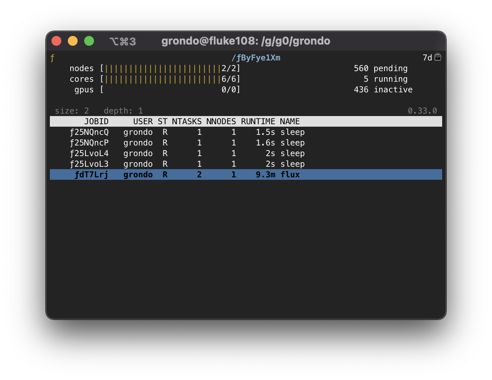
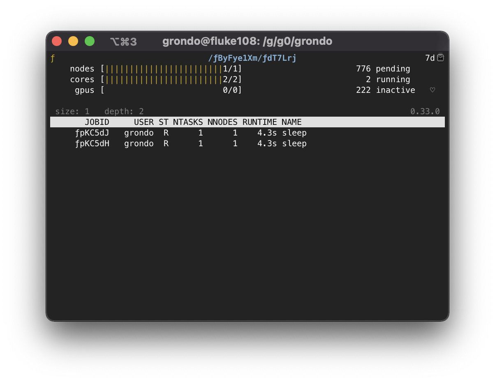

.. _hierarchies:

=================================
Working with Flux Job Hierarchies
=================================

A key feature of Flux is the ability to run an instance to manage a workload
in almost any environment. From a session started on a laptop with ``flux
start --test-size=1``, to a batch job running across thousands of nodes
on a cluster, Flux provides a consistent interface to resources.

These resources and the work assigned to them may then be further
divided by running new instances of Flux as jobs via ``flux mini batch``,
``flux mini alloc``, or ``flux mini submit ... flux start``, each of which
can further divide resources through more instances, and so on. Since an
instance of Flux has its own scheduler and configuration, this can aid in
job throughput or scheduler specialization when complex systems of jobs
are being handled.

However, even for a small hierarchy of jobs, understanding the state of
running instances can be a challenge, so Flux offers several high level
concepts and tools to ease their management.

This guide gives an introduction to managing Flux job hierarchies, whether
they are initiated under a Flux system instance, a foreign resource manager,
or under a test session running on a laptop.

----------------------
Instance level (depth)
----------------------

A Flux instance records its depth in the current job hierarchy in the
``instance-level`` attribute. This attribute can be useful when descending
a hierarchy of jobs. In this guide, the following value of ``PS1`` will
be used to indicate the size and depth of the current enclosing instance
for reference purposes:

.. code-block:: console

  $ export PS1=$'${FLUX_URI+[s=$(flux getattr size),d=$(flux getattr instance-level)]} $ '
  $ flux start --test-size=1
  [s=1,d=0] $ 

Note that the depth starts at 0 for any instance that is not started
as a Flux job, such as the system instance, an instance started under
a foreign resource manager, or a test instance as above. An instance
with a depth of 0 is also called the *root* instance.

------------------------------
Create a simple test hierarchy
------------------------------

A hierarchy of Flux jobs starts with a system instance of Flux or a single
user instance started under a foreign resource manager or via the
``-s, --test-size=N`` option of :core:man1:`flux-start`. In this guide, we will
start a test instance of size 4, since this can be performed in any
environment where Flux is installed:

.. code-block:: console

   $ flux start -s 4
   [s=4,d=0] $ 

However, the example commands used here should work similarly no matter
how your instance of Flux was started, though the amount of resources
available in your Flux session may differ and jobids will not match
those in examples.

Now we can initiate some test batch jobs. In Flux, batch jobs are submitted
with the :core:man1:`flux-mini` ``flux mini batch`` command, which starts a
new Flux instance and runs the provided batch script as the *initial
program* of the instance. When the batch script exits, the Flux instance
shuts down and exits as well.

.. code-block:: console

  [s=4,d=0] $ flux mini batch -n2 --wrap flux mini submit --wait --cc=1-1000 sleep 10
  ƒ9anfxdew
  [s=4,d=0] $

The command above uses the ``flux mini batch`` ``--wrap`` option to wrap
the remainder of arguments in a ``#!/bin/sh`` script, which allows us to
submit a one-liner batch script without creating a separate file. The batch
script then submits 1000 copies of ``sleep`` and waits for them all to
complete. The ``--wait`` is important here, since ``flux mini submit``
exits by default after all work has been submitted, and this would cause
the batch script to exit and terminate the batch job before any work is
complete.

Now, verify that the job started running:

.. code-block:: console

  [s=4,d=0] $ flux jobs
         JOBID USER     NAME       ST NTASKS NNODES  RUNTIME NODELIST
     ƒ9anfxdew grondo   flux        R      2      1   2.415m fluke108
  [s=4,d=0] $

If your terminal supports color, this job will be highlighted in blue
to indicate that it is an instance of Flux.

In order to demonstrate a deeper job hierarchy, we also submit a job
that itself submits more batch work:

.. code-block:: shell
   :caption: batch.sh

   #!/bin/sh
   flux mini batch -n2 --wrap flux mini submit --wait --cc=1-1000 sleep 10
   flux mini submit --cc=1-1000 sleep 10
   flux queue idle

Here, the batch script ``batch.sh`` submits another batch job requesting 2
cores from the enclosing instance, again running 1000 ``sleep`` jobs. Then
another 1000 ``sleep`` jobs are submitted directly, to show that batch
and normal jobs can be mixed together. Finally, since each of these jobs
were submitted without the ``--wait`` flag, ``flux queue idle`` is used
to block until the job queue is empty, meaning all work has completed.

.. code-block:: console

  [s=4,d=0] $ flux mini batch -n6 batch.sh
  ƒByFye1Xm
  [s=4,d=0] $ flux jobs
         JOBID USER     NAME       ST NTASKS NNODES  RUNTIME NODELIST
     ƒByFye1Xm grondo   batch.sh    R      6      2   6.653s fluke[108,108]
     ƒ9anfxdew grondo   flux        R      2      1   5.348m fluke108

----------------------
Listing Flux instances
----------------------

When listing jobs with :core:man1:`flux-jobs`, there are several fields
specific to Flux instances which may be useful. These are prefixed with
``instance.`` and are detailed in the `OUTPUT FORMAT <https://flux-framework.readthedocs.io/projects/flux-core/en/latest/man1/flux-jobs.html#output-format>`_
section of the :core:man1:`flux-jobs` man page.

For example, these fields can be used to show the progress and utilization
of running batch jobs for the current user

.. code-block:: console

  [s=4,d=0] $ flux jobs -o '{id.f58:<12} {name:<12} {instance.progress!P:>5} {instance.utilization!P:>5} {instance.gpu_utilization!P:>5h} {nodelist}'
  JOBID        NAME          PROG CORE%  GPU% NODELIST
  ƒByFye1Xm    batch.sh     7.99%  100%     - fluke[108,108]
  ƒ9anfxdew    flux          8.2%  100%     - fluke108
  [s=4,d=0] $

Here *progress* is the percent of total jobs that are inactive, and
*utilization* is the total number of a resource in the instance that is
currently allocated.  No GPU utilization is displayed since there are no GPU
resources allocated to this instance.

------------------------
Listing jobs recursively
------------------------

By default, :core:man1:`flux-jobs` only lists jobs in the current
enclosing instance. However, with the option ``-R, --recursive``,
any job that is also an instance of Flux will be listed recursively:

.. code-block:: console

  [s=4,d=0] $ flux jobs -Rf running
         JOBID USER     NAME       ST NTASKS NNODES  RUNTIME NODELIST
     ƒByFye1Xm grondo   batch.sh    R      6      2   3.876m fluke[108,108]
     ƒ9anfxdew grondo   flux        R      2      1   9.113m fluke108
  
  ƒByFye1Xm:
       ƒwbiYwb grondo   sleep       R      1      1   0.143s fluke108
       ƒwbiYwa grondo   sleep       R      1      1   0.175s fluke108
       ƒwbiYwZ grondo   sleep       R      1      1   0.850s fluke108
       ƒwaEZfE grondo   sleep       R      1      1   1.152s fluke108
       ƒdT7Lrj grondo   flux        R      2      1   3.845m fluke108
  
  ƒByFye1Xm/ƒdT7Lrj:
       ƒnSxz4B grondo   sleep       R      1      1   1.637s fluke108
       ƒnSxz4A grondo   sleep       R      1      1   1.664s fluke108
  
  ƒ9anfxdew:
       ƒcgdiQQ grondo   sleep       R      1      1   8.424s fluke108
       ƒcgdiQP grondo   sleep       R      1      1   8.444s fluke108
  

The depth to recurse can be specified via the ``-L, --level=N``
option. If the ``--stats`` option is specified, then each instance output
is accompanied by some job statistics:

.. code-block:: console

  [s=4,d=0] $ flux jobs -Rf running -L1 --stats
  2 running, 0 completed, 0 failed, 0 pending
         JOBID USER     NAME       ST NTASKS NNODES  RUNTIME NODELIST
     ƒByFye1Xm grondo   batch.sh    R      6      2   6.376m fluke[108,108]
     ƒ9anfxdew grondo   flux        R      2      1   11.61m fluke108
  
  ƒByFye1Xm:
  5 running, 296 completed, 0 failed, 700 pending
      ƒ21fSakP grondo   sleep       R      1      1   3.385s fluke108
      ƒ21dxbU8 grondo   sleep       R      1      1   3.435s fluke108
      ƒ21dxbU7 grondo   sleep       R      1      1   4.215s fluke108
      ƒ21dxbU6 grondo   sleep       R      1      1   4.271s fluke108
       ƒdT7Lrj grondo   flux        R      2      1   6.345m fluke108
  
  ƒ9anfxdew:
  2 running, 136 completed, 0 failed, 862 pending
       ƒcxwaWC grondo   sleep       R      1      1   6.722s fluke108
       ƒcxwaWB grondo   sleep       R      1      1   6.749s fluke108

-------------------
Flux pstree command
-------------------

The :core:man1:`flux-pstree` command is also useful when working with
complex hierarchies of Flux jobs. It offers a :linux:man1:`pstree` like
display of jobs by name. Many options are provided to give a high level
information about the status of a set of nested jobs. 

By default, only running jobs are displayed. Identical jobs are collapsed
for a more compact representation:

.. code-block:: console

  [s=4,d=0] $ flux pstree
  .
  ├── batch.sh
  │   ├── 4*[sleep]
  │   └── flux
  │       └── 2*[sleep]
  └── flux
      └── 2*[sleep]

In the output above the enclosing instance is the root of the tree display
and is represented by a single ``.``. If the enclosing instance is itself
a Flux job, then the job name is used instead of the ``.`` placeholder.
  
Sometimes it is useful to get instance or parent jobids in the display.
This can be enabled with the ``-p, --parent-ids`` option, e.g.

.. code-block:: console

  [s=4,d=0] $ flux pstree -p
  . .
  ├── ƒByFye1Xm batch.sh
  │   ├── 4*[sleep]
  │   └── ƒdT7Lrj flux
  │       └── 2*[sleep]
  └── ƒ9anfxdew flux
      └── 2*[sleep]

All jobs for the current user in any state can also be displayed with
the ``-a, --all`` option. In this case, the job status abbreviation is
included to differentiate jobs in different states:

.. code-block:: console

  [s=4,d=0] $ flux pstree -a
  .
  ├── batch.sh
  │   ├── 220*[sleep:PD]
  │   ├── 4*[sleep:R]
  │   ├── flux
  │   │   ├── 612*[sleep:PD]
  │   │   ├── 2*[sleep:R]
  │   │   └── 386*[sleep:CD]
  │   └── 775*[sleep:CD]
  └── flux
      ├── 740*[sleep:PD]
      ├── 2*[sleep:R]
      └── 258*[sleep:CD]
  
The ``flux pstree`` command can also display extended job details before the
tree part with the ``-x, --extended`` or the ``-d, --details=NAME`` option.

.. code-block:: console

  [s=4,d=0] $ flux pstree -x
         JOBID USER     ST NTASKS NNODES  RUNTIME
     ƒByFye1Xm grondo    R      6      2    17.4m batch.sh
      ƒ2FHdyxB grondo    R      1      1   0.411s ├── sleep
      ƒ2FG9zfz grondo    R      1      1   0.462s ├── sleep
      ƒ2FG9zfy grondo    R      1      1   0.663s ├── sleep
      ƒ2FG9zfx grondo    R      1      1   0.692s ├── sleep
       ƒdT7Lrj grondo    R      2      1   17.37m └── flux
       ƒs8GidH grondo    R      1      1   0.625s     ├── sleep
       ƒs8GidG grondo    R      1      1   0.651s     └── sleep
     ƒ9anfxdew grondo    R      2      1   22.64m flux
       ƒez4bmS grondo    R      1      1   2.747s ├── sleep
       ƒez4bmR grondo    R      1      1   2.753s └── sleep
  [s=4,d=0] $ flux pstree --details=stats
         JOBID           STATS              RUNTIME
     ƒByFye1Xm   PD:164 R:5 CD:832 F:0      0:17:42 batch.sh
      ƒ2FK7yEZ                              0:00:03 ├── sleep
      ƒ2FK7yEY                              0:00:03 ├── sleep
      ƒ2FK7yEX                              0:00:03 ├── sleep
      ƒ2FHdyxL                              0:00:03 ├── sleep
       ƒdT7Lrj   PD:584 R:2 CD:414 F:0      0:17:40 └── flux
       ƒs9khue                              0:00:03     ├── sleep
       ƒs9khud                              0:00:03     └── sleep
     ƒ9anfxdew   PD:728 R:2 CD:270 F:0      0:22:56 flux
       ƒfGNTsD                              0:00:01 ├── sleep
       ƒfDQVJY                              0:00:01 └── sleep
  [s=4,d=0] $
  
When the ``-x, --extended`` or ``-d, --details=NAME`` options are used,
then the root of the tree is automatically skipped. To restore the
display of the root instance, the ``--skip-root=no`` option may be
used.

----------------
Flux top command
----------------

The ``flux-top(1)`` utility may also be used to explore nested jobs.
If run without arguments, it monitors the default Flux instance, but it
can also target a running job using a high-level URI such as a Flux jobid.

Once ``flux top`` is started, it displays a summary of information in the
top pane, including the jobid (if running against a job), a summary of
resource status, the instance depth, the time remaining if the job
is running with a time limit, and high-level job statistics including
the total number of pending, running, and inactive jobs.

Below the summary pane, a live view of jobs is displayed. Jobs which are
also Flux instances are colored in blue. Active Flux instances can be
selected by paging through the job display with the up and down arrow
keys or ``j`` and ``k``.

.. image:: images/flux-top-level-0.png

Once a job of interest is selected, ``flux top`` will recursively call
itself on that job when the enter key is pressed. The summary and job listing
will now reflect the selected job:

.. image:: images/flux-top-level-1.png

If there are further jobs interest, the procedure may be repeated:

To pop back up to the previous instance, use the ``q`` key. At an instance
depth of ``0``, ``flux top`` will exit.

The ``flux top`` command can also directly target jobs by jobid or high-level
URI. This means that a nested job can be targeted directly by a path of jobids,
e.g.

.. code-block:: console

  [s=4,d=0] $ flux top ƒByFye1Xm/ƒdT7Lrj

-------------------------
Connecting to nested jobs
-------------------------

The :core:man1:`flux-proxy` command can be used to connect to a target Flux
instance anywhere within job hierarchy. This allows a user to interact
with the job as an enclosing instance. The ``flux proxy`` command can take
any high-level URI as its argument (See :core:man1:`flux-uri` for a detailed
description of Flux URIs), so a jobid works fine:

.. code-block:: console

  [s=4,d=0] $ flux jobs
         JOBID USER     NAME       ST NTASKS NNODES  RUNTIME NODELIST
     ƒByFye1Xm grondo   batch.sh    R      6      2   22.12m fluke[108,108]
     ƒ9anfxdew grondo   flux        R      2      1   27.35m fluke108
  [s=4,d=0] $ flux proxy ƒByFye1Xm
  [s=2,d=1] $

Note that our prompt now reports that we are at an instance depth of ``1``
instead of zero. We can now interact with this child instance as if it were
our enclosing instance.

``flux proxy`` spawns a new shell after connecting to the target instance.
To disconnect, simply exit the shell:

.. code-block:: console

  [s=2,d=1] $ exit
  exit
  [s=4,d=0] $
  
Since :core:man1:`flux-proxy` supports any high-level URI, it is also possible
to connect to a nested job directly, e.g.:

.. code-block:: console

  [s=4,d=0] $ flux proxy ƒByFye1Xm/ƒdT7Lrj
  [s=1,d=2] $ flux resource list
       STATE NNODES   NCORES    NGPUS NODELIST
        free      0        0        0
   allocated      1        2        0 fluke108
        down      0        0        0
  [s=1,d=2] $ flux jobs --stats-only
  2 running, 724 completed, 0 failed, 274 pending
  [s=1,d=2] $

Or even a Flux instance running as a Slurm job:

.. code-block:: console

  $ squeue -u grondo
      JOBID PARTITION     NAME     USER ST       TIME  NODES NODELIST(REASON)
    8327174    pdebug     flux   grondo  R       0:22      2 quartz[4-5]
  $ flux proxy slurm:8327174
  [s=2,d=0] $ flux resource list
        STATE NNODES   NCORES    NGPUS NODELIST
        free      2       72        0 quartz[4-5]
   allocated      0        0        0 
        down      0        0        0 
  [s=2,d=0] $

